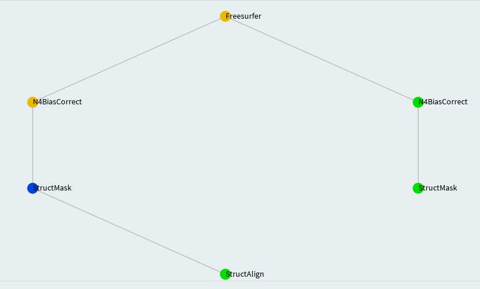
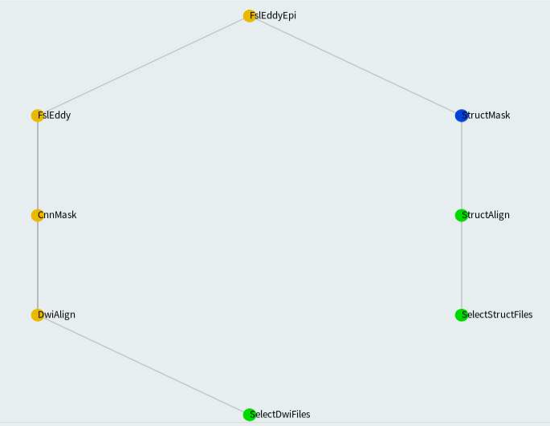

[](https://doi.org/10.5281/zenodo.3666802) []() []()

Developed by Tashrif Billah and Sylvain Bouix, Brigham and Women's Hospital (Harvard Medical School).


Table of Contents
=================

   * [Recap](#recap)
   * [Providing input](#providing-input)
   * [Structural pipeline](#structural-pipeline)
      * [Create masks](#create-masks)
         * [MABS mask](#mabs-mask)
         * [Warped mask](#warped-mask)
      * [Run FreeSurfer](#run-freesurfer)
         * [With T1w only](#with-t1w-only)
         * [With both T1w and T2w](#with-both-t1w-and-t2w)
   * [DWI pipeline](#dwi-pipeline)
      * [Create masks](#create-masks-1)
      * [Run FSL eddy and PNL epi](#run-fsl-eddy-and-pnl-epi)
      * [Run FSL eddy](#run-fsl-eddy)
      
      
Table of Contents created by [gh-md-toc](https://github.com/ekalinin/github-markdown-toc)


# Recap
This tutorial assumes you have made yourself familiar with [how Luigi works](README.md#how-luigi-works). In brief, 
each Luigi task executes its prerequisite tasks before executing the task itself. If expected output of a task exist, 
that will not rerun. Progress of the pipelines can be viewed in [http://cmu166.research.partners.org:8082](). 

Another assumption is-- you have [organized your data](#1-organize-data-according-to-bids) according to BIDS convention. 
In the following, we shall explain how to run pipelines on DIAGNOSE_CTE data.

# Providing input 

The [Luigi workflows](../workflows/) accept input in two ways-- through the command line and through a config file. 
The motivation for that compartmentalization is to differentiate between high-level (former) and low-level (latter) inputs.
High-level inputs facilitate launching workflows while low-level inputs specify parameters pertinent to tasks in the workflow, 
some of which are optional. Task specific parameters are provided in a configuration file defined via 
environment variable `LUIGI_CONFIG_PATH`.

```bash
usage: ExecuteTask.py [-h] --bids-data-dir BIDS_DATA_DIR -c C -s S
                      [--dwi-template DWI_TEMPLATE]
                      [--t1-template T1_TEMPLATE] [--t2-template T2_TEMPLATE]
                      --task
                      {StructMask,Freesurfer,CnnMask,PnlEddy,PnlEddyEpi,FslEddy,FslEddyEpi,TopupEddy,PnlEddyUkf,Fs2Dwi,Wmql,Wmqlqc}
                      [--num-workers NUM_WORKERS]
                      [--derivatives-name DERIVATIVES_NAME]

pnlpipe glued together using Luigi, optional parameters can be set by
environment variable LUIGI_CONFIG_PATH, see luigi-pnlpipe/scripts/params/*.cfg
as example

optional arguments:
  -h, --help            show this help message and exit
  --bids-data-dir BIDS_DATA_DIR
                        /path/to/bids/data/directory
  -c C                  a single case ID or a .txt file where each line is a
                        case ID
  -s S                  a single session ID or a .txt file where each line is
                        a session ID
  --dwi-template DWI_TEMPLATE
                        glob bids-data-dir/dwi-template to find input data
                        e.g. sub-*/ses-*/dwi/*_dwi.nii.gz 
                        (default: sub-*/dwi/*_dwi.nii.gz)
  --t1-template T1_TEMPLATE
                        glob bids-data-dir/t1-template to find input data
                        e.g. sub-*/ses-*/anat/*_T1w.nii.gz 
                        (default: sub-*/anat/*_T1w.nii.gz)
  --t2-template T2_TEMPLATE
                        glob bids-data-dir/t2-template to find input data
                        (default: None)
  --task {StructMask,Freesurfer,CnnMask,PnlEddy,PnlEddyEpi,FslEddy,FslEddyEpi,TopupEddy,PnlEddyUkf,Fs2Dwi,Wmql,Wmqlqc}
                        number of Luigi workers (default: None)
  --num-workers NUM_WORKERS
                        number of Luigi workers (default: 1)
  --derivatives-name DERIVATIVES_NAME
                        relative name of bids derivatives directory,
                        translates to bids-data-dir/derivatives/derivatives-
                        name (default: pnlpipe)
```

In the following, we shall provide both mandatory and optional settings for each workflow. Before running any workflow, 
you should set up your terminal so that various prerequisite software i.e. FSL, FreeSurfer, ANTs etc. are found. 
In addition, define `PYTHONPATH`:

    cd ~/luigi-pnlpipe
    export PYTHONPATH=`pwd`/scripts:`pwd`/workflows:$PYTHONPATH
    
    # in case you have space shortage in /tmp or it is inaccessible to you
    export PNLPIPE_TMPDIR=~/tmp

# Structural pipeline

The goal of structural pipeline is to perform FreeSurfer segmentation. To be able to do that, we need mask for 
structural images-- T1w and maybe T2w.

## Create masks

MABS (Multi Atlas Brain Segmentation) remains as the acceptable technique to create mask for structural images. 
We shall create a MABS mask for one modality only and then quality check it manually. We shall warp that 
quality checked mask to obtain mask for other modalities. This approach minimizes the human effort required to quality 
check masks for all modalities. Nevertheless, you can create MABS mask for all modalities and quality check them manually.  


### MABS mask

MABS requires training data which are specified through `csvFile` below. `StructMask` task is capable of waiting until 
quality checking of automated mask is complete, an option which can be invoked by setting `mask_qc: True`. 
However, you can set `mask_qc: False`, obtain all masks, and then quality check at a later time.
So the content of `LUIGI_CONFIG_PATH` is following:

```cfg
[StructMask]
mabs_mask_nproc: 8
fusion:
debug: False
reg_method:
slicer_exec:
mask_qc: False

csvFile: /path/to/trainingDataT2Masks.csv
ref_img:
ref_mask:
```

Finally, save the above configuration in `mabs_mask_params.cfg` and run `StructMask` task as follows:

```bash
export LUIGI_CONFIG_PATH=/path/to/mabs_mask_params.cfg

# individual
# MABS masking of T2w image for case 1001
exec/ExecuteTask --task StructMask \
--bids-data-dir /data/pnl/DIAGNOSE_CTE_U01/rawdata -c 1001 --t2-template sub-*/ses-01/anat/*_T2w.nii.gz

# group
# MABS masking of T2w image for all cases
exec/ExecuteTask --task StructMask \
--bids-data-dir /data/pnl/DIAGNOSE_CTE_U01/rawdata -c /path/to/caselist.txt --t2-template sub-*/anat/*_T2w.nii.gz \
--num-workers 8
```

Quality checked mask must be saved with `Qc` suffix in the `desc` field for its integration with later part of 
the structural pipeline. Example: 

        Mabs mask   : sub-1001/ses-01/anat/sub-1001_ses-01_desc-T2wXcMabs_mask.nii.gz
    Quality checked : sub-1001/ses-01/anat/sub-1001_ses-01_desc-T2wXcMabsQc_mask.nii.gz


A couple of points to note regarding the above examples:
* For executing task through LSF, you should be using the individual example.
* When using group example, depending on the number of cases and CPUs in your machine, you should provide 
a suitable `--num-workers` so optimal number of cases are processed parallelly allowing room for other users 
in a shared cluster environment.
* Although we provided both individual and group examples in the above, we shall be providing only individual examples 
in the rest of the tutorial. You can follow the above group example as a model for the rest.
* Each relevant configuration snippet should be saved in a `.cfg` file and defined in `LUIGI_CONFIG_PATH` environment variable.
* If there is more than one task under a workflow, which is generally the case, a `[DEFAULT]` section should be used 
in their configuration file to allow parameter sharing with top level-tasks. [Run FSL eddy and PNL epi](#run-fsl-eddy-and-pnl-epi) sections 
explains this requirement in detail.

Tips:
* `lscpu` command will show you the number of processors available. 
As a rule of thumb, you can choose `--num-workers` to be half the number of available processors on a shared environment. 
* `vmstat -s -S M` will show you the RAM available

### Warped mask

For DIAG-CTE data, we have created MABS mask for T2w images. Then we have warped them to obtain mask for T1w and AXT2 
images. Alternatively, you can create masks for T1w images first and then use them to create masks 
for T2w and AXT2 images. Once again, we need a configuration to be provided via `LUIGI_CONFIG_PATH`:

```cfg
[StructMask]
mabs_mask_nproc: 8
fusion:
debug: False
reg_method: rigid
slicer_exec:
mask_qc: False

csvFile:
ref_img: *_desc-Xc_T2w.nii.gz
ref_mask: *_desc-T2wXcMabsQc_mask.nii.gz
```

Notice the values of `ref_img` and `ref_mask` beginning with asterisk (`*`). The asterisk (`*`) is important. 
These are the patterns with which output directory is searched to obtain structural image and associated MABS mask. 
The structural image is used to register to target space, in this case T1w or AXT2 space. Finally, the associated MABS 
mask is warped to target space.

Other important parameters are `reg_method` and `mask_qc`. `reg_method` takes a value of either `rigid` or `SyN` 
indicating the type of `antsRegistration` you would like to perform. On the other hand, since MABS mask was already 
quality checked, `mask_qc` is set to False. Notice the `csvFile` field that must be kept empty otherwise MABS masking 
procedure will be triggered.

Putting them all together:

```bash
export LUIGI_CONFIG_PATH=/path/to/mask_warping_params.cfg

exec/ExecuteTask --task StructMask \
--bids-data-dir /data/pnl/DIAGNOSE_CTE_U01/rawdata -c 1001 --t1-template sub-*/ses-01/anat/*_T1w.nii.gz
```

**NOTE** Creating T1w and AXT2 masks separately is not required. They can be generated as part of 
`Freesurfer` and `FslEddyEpi` tasks respectively.

## Run FreeSurfer



We use T1w and/or T2w images to perform FreeSurfer segmentation. T1w and/or T2w images are multiplied by 
their respective masks and passed through `N4BiasFieldCorrection`. This intermediate step does not require 
any user intervention. On the other hand, since the method for obtaining T1w masks is 
dependent upon T2w MABS masks, the latter have to be generated separately before running `Freesurfer`. The `Freesurfer` 
task will generate T1w masks to fulfill its requirement.

### With T1w only

```cfg
[DEFAULT]

## [StructMask] ##
mabs_mask_nproc: 8
fusion:
debug: False
reg_method: rigid
slicer_exec:


## [Freesurfer] ##
t1_csvFile:
t1_ref_img: *_desc-Xc_T2w.nii.gz
t1_ref_mask: *_desc-T2wXcMabsQc_mask.nii.gz
t1_mask_qc: False

freesurfer_nproc: 4
expert_file:
no_hires: True
no_skullstrip: True
subfields: True
fs_dirname: freesurfer

[StructMask]

[Freesurfer]
```

Notice the introduction of `t1_` prefix preceding parameters defined for `StructMask` task itself. 
The purpose of this introduction would be clear in the following section. Run `Freesurfer` task as follows:

```bash
export LUIGI_CONFIG_PATH=/path/to/fs_with_t1.cfg

exec/ExecuteTask --task Freesurfer \
--bids-data-dir /data/pnl/DIAGNOSE_CTE_U01/rawdata -c 1001 --t1-template sub-*/ses-01/anat/*_T1w.nii.gz
```


### With both T1w and T2w

```cfg
[DEFAULT]

## [StructMask] ##
mabs_mask_nproc: 8
fusion:
debug: False
reg_method: rigid
slicer_exec:


## [Freesurfer] ##
t1_csvFile:
t1_ref_img: *_desc-Xc_T2w.nii.gz
t1_ref_mask: *_desc-T2wXcMabsQc_mask.nii.gz
t1_mask_qc: False

t2_csvFile: /path/to/trainingDataT2Masks.csv
t2_ref_img:
t2_ref_mask:
t2_mask_qc: True

freesurfer_nproc: 4
expert_file:
no_hires: True
no_skullstrip: True
subfields: True
fs_dirname: freesurfer

[StructMask]

[Freesurfer]
```

Now, let's look at the purpose of using `t1_` and `t2_` prefix preceding parameters defined for `StructMask` task itself. 
T2w masks are product of MABS while T1w masks are product of warping. Having same values for `StructMask` task parameters 
would not allow this differentiation. Moreover, notice `t1_mask_qc: False` but `t2_mask_qc: True`, the latter telling 
the pipeline to look for T2w masks with `Qc` suffix in `desc` field.

Finally, to tell `Freesurfer` task to use both T1w and T2w images, we shall provide both templates:

```bash
export LUIGI_CONFIG_PATH=/path/to/fs_with_both_t1_t2.cfg

exec/ExecuteTask --task Freesurfer \
--bids-data-dir /data/pnl/DIAGNOSE_CTE_U01/rawdata -c 1001 \
--t1-template sub-*/ses-01/anat/*_T1w.nii.gz \
--t2-template sub-*/ses-01/anat/*_T2w.nii.gz
```


# DWI pipeline


## Create masks

Any automated mask should be quality checked visually. To reiterate, the pipelines are equipped with the capability 
to wait until an automatically created mask is quality checked and progress from there. Yet, we explain the means of 
generating all the masks and quality checking them in two discrete steps. 

```cfg
[CnnMask]
slicer_exec:
dwi_mask_qc: False
model_folder: /data/pnl/soft/pnlpipe3/CNN-Diffusion-MRIBrain-Segmentation/model_folder
percentile: 97
```

Run `CnnMask` task as follows:

```bash
export LUIGI_CONFIG_PATH=/path/to/cnn_mask_params.cfg

exec/ExecuteTask --task CnnMask \
--bids-data-dir /data/pnl/DIAGNOSE_CTE_U01/rawdata -c 1001 --dwi-template sub-*/ses-01/dwi/*_dwi.nii.gz
```

As it was done for saving quality checked structural masks, quality checked dwi masks must be saved 
with `Qc` suffix in the `desc` field for its integration with later part of the dwi pipeline. Example: 

        Cnn mask    : sub-1001/ses-01/dwi/sub-1001_ses-01_desc-dwiXcCNN_mask.nii.gz
    Quality checked : sub-1001/ses-01/dwi/sub-1001_ses-01_desc-dwiXcCNNQc_mask.nii.gz


## Run FSL eddy and PNL epi

The last task of dwi pipeline is EPI correction that makes use of a different T2w image acquired in the same plane of 
dwi, identified by `_AXT2.nii.gz` suffix. The configuration file to be used for this top-level task is:

```cfg
[DEFAULT]

## [StructMask] ##
csvFile:
mabs_mask_nproc: 8
fusion:
mask_qc: False
ref_img: *_desc-Xc_T2w.nii.gz
ref_mask: *_desc-T2wXcMabsQc_mask.nii.gz
reg_method: SyN


## [StructMask] [PnlEddy] [PnlEddyEpi] ##
debug: False


## [StructMask] [BseBetmask] [CnnMask] ##
slicer_exec:


## [BseMask] [CnnMask] ##
dwi_mask_qc: True


## [CnnMask] ##
model_folder: /data/pnl/soft/pnlpipe3/CNN-Diffusion-MRIBrain-Segmentation/model_folder


## [BseExtract] ##
which_bse:
b0_threshold: 50


## [FslEddy] [FslEddyEpi] ##
acqp: /data/pnl/DIAGNOSE_CTE_U01/acqp.txt
index: /data/pnl/DIAGNOSE_CTE_U01/index.txt
config: /data/pnl/DIAGNOSE_CTE_U01/eddy_config.txt


## [PnlEddyEpi] [FslEddyEpi] ##
epi_nproc: 8


[StructMask]

[BseExtract]

[CnnMask]

[FslEddy]

[FslEddyEpi]

```

Notice the use of `[DEFAULT]` section that allows sharing of parameters across various tasks. Refer to the flowchart of 
`FslEddyEpi`:



`FslEddyEpi` task directly depends upon `FslEddy` and `StructMask` tasks. So the parameters of the latter two also become 
the parameters of the top-level task. On the other hand, defining task specific parameters under `FslEddy` and `StructMask` 
in the configuration would not make them visible to the top-level task. Hence, the right thing is to define them under 
`[DEFAULT]` section so they are visible to any top-level tasks.

Finally, run the big dwi pipeline as follows:

```bash
export LUIGI_CONFIG_PATH=/path/to/dwi_pipe_params.cfg

exec/ExecuteTask --task FslEddyEpi \
--bids-data-dir /data/pnl/DIAGNOSE_CTE_U01/rawdata -c 1001 \
--dwi-template sub-*/ses-01/dwi/*_dwi.nii.gz \
--t2-template sub-*/ses-01/anat/*_AXT2.nii.gz
```

A few things to note here:
* The `--t2-template` is different than what we used for `Freesurfer` task since we need to use an in-plane T2w image 
for EPI correction, not the structural one.
* The parameters for `StructMask` task echo those explained in [Warped mask](#warped-mask)
* `dwi_mask_qc: True` tells the program to look for quality checked dwi masks while `mask_qc: False` tells it to look for 
non quality checked mask. As mentioned before, since a MABS mask was already quality checked, we should not require to 
quality check it again after warp assuming `antsRegistration`, either `rigid` or `SyN`, did a good job and not introduce 
any new artifact in the warped mask. 
* Notice that we used computation intensive `SyN` registration to obtain AXT2 mask compared to `rigid` registration 
we used for obtaining T2w mask.

## Run FSL eddy

This section serves as an example about running `FslEddy` separately. When you run `FslEddyEpi`, it will run the former 
already to fulfill its requirement.

Configuration:

```cfg
[DEFAULT]

## [CnnMask] ##
slicer_exec:
dwi_mask_qc: False
model_folder: /data/pnl/soft/pnlpipe3/CNN-Diffusion-MRIBrain-Segmentation/model_folder

## [FslEddy] ##
acqp: /data/pnl/DIAGNOSE_CTE_U01/acqp.txt
index: /data/pnl/DIAGNOSE_CTE_U01/index.txt
config: /data/pnl/DIAGNOSE_CTE_U01/eddy_config.txt

[CnnMask]

[FslEddy]
```

Run it:

```bash
export LUIGI_CONFIG_PATH=/path/to/fsl_eddy_params.cfg

exec/ExecuteTask --task FslEddy \
--bids-data-dir /data/pnl/DIAGNOSE_CTE_U01/rawdata -c 1001 --dwi-template sub-*/ses-01/dwi/*_dwi.nii.gz
```

The mask and baseline image provided to `FslEddy` are approximated as eddy corrected mask and baseline image that can 
be fed into later task FslEddyEpi.

 
