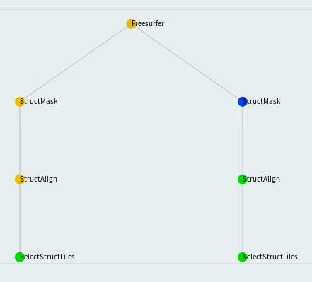
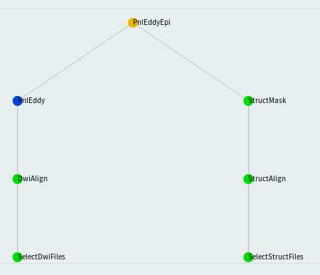
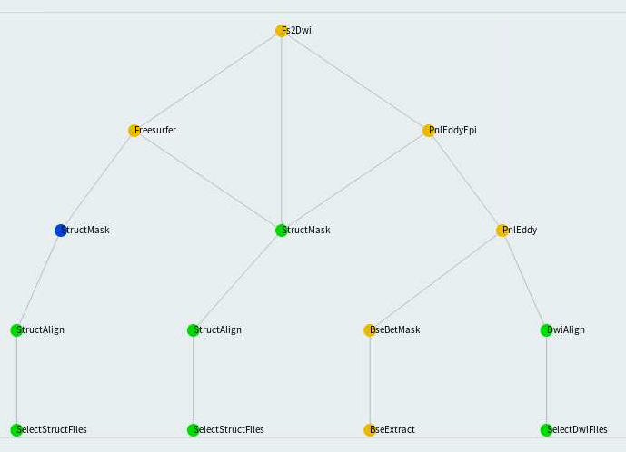
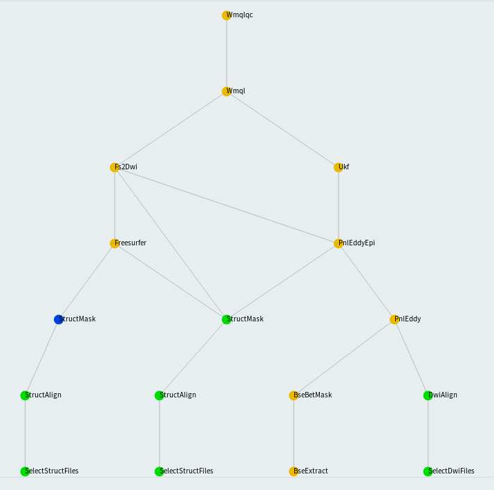

[](https://doi.org/10.5281/zenodo.3666802) []() []()

Developed by Tashrif Billah and Sylvain Bouix, Brigham and Women's Hospital (Harvard Medical School).


Table of Contents
=================

   * [Luigi pipeline](#luigi-pipeline)
   * [Citation](#citation)
   * [How Luigi works](#how-luigi-works)
   * [Running luigi-pnlpipe](#running-luigi-pnlpipe)
      * [1. Organize data according to BIDS](#1-organize-data-according-to-bids)
      * [2. Source pnlpipe3 environment](#2-source-pnlpipe3-environment)
      * [3. Initialize luigid server](#3-initialize-luigid-server)
      * [4. Execute task](#4-execute-task)
         * [i. Workstation](#i-workstation)
            * [a. Launch job](#a-launch-job)
            * [b. Monitor progress](#b-monitor-progress)
         * [ii. HPC](#ii-hpc)
            * [a. Launch job](#a-launch-job-1)
            * [b. Monitor progress](#b-monitor-progress-1)
   * [Example commands](#example-commands)
      * [Structural masking](#structural-masking)
      * [Freesurfer segmentation](#freesurfer-segmentation)
      * [Eddy and correction](#eddy-and-correction)
      * [UKFTractography](#ukftractography)
      * [Wmqlqc](#wmqlqc)
   * [Advanced](#advanced)
      * [Task definitions](#task-definitions)
      * [Execution](#execution)
         * [From command line](#from-command-line)
         * [From Python/IPython](#from-pythonipython)
   * [Workflows](#workflows)
      * [StructMask](#structmask)
      * [Freesurfer](#freesurfer)
      * [PnlEddy](#pnleddy)
      * [PnlEddyEpi](#pnleddyepi)
      * [Ukf](#ukf)
      * [Fs2Dwi](#fs2dwi)
      * [Wmql](#wmql)
      * [Wmqlqc](#wmqlqc-1)
   * [Parameters](#parameters)
      * [Mandatory](#mandatory)
      * [Optional](#optional)
         * [struct_pipe_params.cfg](#struct_pipe_paramscfg)
         * [dwi_pipe_params.cfg](#dwi_pipe_paramscfg)
         * [fs2dwi_pipe_params.cfg](#fs2dwi_pipe_paramscfg)
   * [Caveat/Issues](#caveatissues)

Table of Contents created by [gh-md-toc](https://github.com/ekalinin/github-markdown-toc)


# Luigi pipeline

[Luigi](https://github.com/spotify/luigi) is a Python module for building complex pipeline of jobs. 
Psychiatry Neuroimaging Laboratory (PNL) has developed and tested many software modules for MRI processing over years. 
The individual modules are gracefully joined together using Luigi. With the release of *luigi-pnlpipe*, 
researchers should be able to perform MRI processing more elegantly.


# Citation

If this pipeline is useful in your research, please cite as below:

Billah, Tashrif; Bouix, Sylvain, *A Luigi workflow joining individual modules of an MRI processing pipeline*,
https://github.com/pnlbwh/luigi-pnlpipe, 2020, DOI: 10.5281/zenodo.3666802


# How Luigi works

A [Luigi task](https://luigi.readthedocs.io/en/stable/tasks.html) consists of four building blocks:

i) Parameters

ii) requires()

iii) run()

iv) output()


Each individual PNL module is wrapped with a Luigi task. Once a task is scheduled i.e. commanded to execute, Luigi first looks for the `output()` in local directory. 
If the `output()` does not exist, it starts running the task. Again, it first runs the prerequisite (`requires()`) of the task. 
Then the task itself (`run()`).

The merit of Luigi task- it won't repeat a task if the `output()` already exists. On the other hand, the demerit- 
if output of a prior `requires()` task is missing, Luigi will not go back to checking that provided the `output()` of the current task exists. 
So, to force re-run all tasks, you would have to manually delete all intermediate outputs.

The most notable feature of Luigi tool is, it comes with a web visualizer where you can monitor progress of the scheduled tasks.


Another useful feature is multi-worker task scheduling where you can specify number of Luigi workers and each worker 
can run tasks applying parellel processing. It is like you open multiple terminals on your machine and use 
multi-processing independently in each of the terminals. Above all, progress of task is reported to the central 
scheduler that you can view on your web browser.


# Running luigi-pnlpipe

## 1. Organize data according to BIDS

*luigi-pnlpipe* makes use of [Brain Imaging Data Structure (BIDS)](https://bids.neuroimaging.io/). Before running the *luigi-pnlpipe*, 
you should organize your data according to BIDS convention. For example, the following is a minimal BIDS organization:

> tree ~/Downloads/INTRuST_BIDS

    caselist.txt
    derivatives
    sub-003GNX007
    ├── anat
    │   ├── sub-003GNX007_T1w.nii.gz
    │   └── sub-003GNX007_T2w.nii.gz
    └── dwi
        ├── sub-003GNX007_dwi.bval
        ├── sub-003GNX007_dwi.bvec
        └── sub-003GNX007_dwi.nii.gz
    sub-003GNX012
    ├── anat
    │   ├── sub-003GNX012_T1w.nii.gz
    │   └── sub-003GNX012_T2w.nii.gz
    └── dwi
        ├── sub-003GNX012_dwi.bval
        ├── sub-003GNX012_dwi.bvec
        └── sub-003GNX012_dwi.nii.gz
    sub-003GNX021
    ├── anat
    │   ├── sub-003GNX021_T1w.nii.gz
    │   └── sub-003GNX021_T2w.nii.gz
    └── dwi
        ├── sub-003GNX021_dwi.bval
        ├── sub-003GNX021_dwi.bvec
        └── sub-003GNX021_dwi.nii.gz


Once data is organized as above, you can define the following arguments:
    
    --bids-data-dir ~/Downloads/INTRuST_BIDS 
    -c ~/Downloads/INTRuST_BIDS/caselist.txt    
    --t1-template sub-id/anat/*_T1w.nii.gz
    --t2-template sub-id/anat/*_T2w.nii.gz
    --dwi-template sub-id/dwi/*_dwi.nii.gz
    
    
When *luigi-pnlpipe* globs `bids-data-dir/sub-id/anat/*_T1w.nii.gz` with `id` replaced by each line in `caselist.txt`, 
it will find the input data.

Finally, output will go to `derivatives/luigi-pnlpipe` directory by default, again following BIDS convention.
        

## 2. Source pnlpipe3 environment

Please follow the installation instruction as noted here. Upon successful installation of all software modules, 
source `.bashrc` to set up your terminal for running `luigid`.

## 3. Initialize luigid server
    
    luigid --background --logdir /tmp/luigi-server.log
    
A useful configuration for `luigid` server is given in `luigi-pnlpipe/workflows/luigi.cfg`. For `luigid` 
to find that configuration, you should change directory and initiate server as follows:

    cd ~/luigi-pnlpipe/workflows/
    luigid --background --logdir /tmp/luigi-server.log

You may also edit `luigi.cfg` as you see fit.  
    

    
## 4. Execute task

For running all workflows of *luigi-pnlpipe* from one place, we have developed the following 
handy script. `luigi-pnlpipe/exec/ExecuteTask` is a soft link for `luigi-pnlpipe/workflows/ExecuteTask.py`. 
You can use one or the other as you like. At this point, you should be able to see the help message. Please take a 
moment to familiarize yourself about its functionality.


> luigi-pnlpipe/exec/ExecuteTask -h

```bash
usage: ExecuteTask [-h] --bids-data-dir BIDS_DATA_DIR -c C
                   [--dwi-template DWI_TEMPLATE] [--t1-template T1_TEMPLATE]
                   [--t2-template T2_TEMPLATE] --task
                   {StructMask,Freesurfer,PnlEddy,PnlEddyEpi,Ukf,Fs2Dwi,Wmql,Wmqlqc}
                   [--num-workers NUM_WORKERS]
                   [--derivatives-dir DERIVATIVES_DIR]

pnlpipe glued together using Luigi, optional parameters can be set by
environment variable LUIGI_CONFIG_PATH, see luigi-pnlpipe/scripts/params/*.cfg
as example

optional arguments:
  -h, --help            show this help message and exit
  --bids-data-dir BIDS_DATA_DIR
                        /path/to/bids/data/directory
  -c C                  a single caseid or a .txt file where each line is a
                        caseid
  --dwi-template DWI_TEMPLATE
                        glob bids-data-dir/t1-template to find input data
                        (default: sub-id/dwi/*_dwi.nii.gz)
  --t1-template T1_TEMPLATE
                        glob bids-data-dir/t2-template to find input data
                        (default: sub-id/anat/*_T1w.nii.gz)
  --t2-template T2_TEMPLATE
                        glob bids-data-dir/t2-template to find input data
                        (default: None)
  --task {StructMask,Freesurfer,PnlEddy,PnlEddyEpi,Ukf,Fs2Dwi,Wmql,Wmqlqc}
                        number of Luigi workers (default: None)
  --num-workers NUM_WORKERS
                        number of Luigi workers (default: 1)
  --derivatives-dir DERIVATIVES_DIR
                        relative name of bids derivatives directory,
                        translates to bids-data-dir/derivatives/derivatives-
                        dir (default: luigi-pnlpipe)
```


### i. Workstation

#### a. Launch job

> luigi/scripts/ExecuteTask.py --task Freesurfer --bids-data-dir ~/INTRuST_BIDS -c ~/INTRuST_BIDS/caselist.txt

#### b. Monitor progress

> firefox http://localhost:8082

### ii. HPC

#### a. Launch job

Save the following as `run.lsf`

```bash
#!/bin/bash

# Copy this file to your project folder (usually called run.lsf), change
# NAME_OF_JOB and NUM_CORES below, edit the command to be run, and then start a
# cluster job by running: 
#     bsub < run.lsf

source /PHShome/tb571/luigi-pnlpipe/scripts/luigi_env

#BSUB -J luigi-pnlpipe
#BSUB -o %J.out
#BSUB -e %J.err
#BSUB -q big
#BSUB -n 4


luigid --logdir /PHShome/tb571/Downloads/luigi-pnlpipe/scripts/luigi-server.log --background

for id in $(cat ~/INTRuST_BIDS/caselist.txt)
do
    luigi/scripts/ExecuteTask.py --task Freesurfer --bids-data-dir ~/Downloads/INTRuST_BIDS/ -c $id
done
```

Then

> bsub < run.lsf


#### b. Monitor progress

> bjobs

> firefox https://cmu166.research.partners.org:8082


## 5. Outputs
    
BIDS specification for naming derivatives is under development and not yet standardized. 
See [here](https://bids-specification.readthedocs.io/en/derivatives/05-derivatives/01-introduction.html) for more details.

* Every derivative file should have a `desc` field with relevant value
* The file name should have only one suffix that identifies what the file is 
such as `_bse` for baseline image, `_mask` for mask etc.

```    
derivatives
└── pnlpipe
    └── sub-003GNX007
        ├── anat
        │   ├── freesurfer
        │   │   ├── label
        │   │   ├── mri
        │   │   ├── scripts
        │   │   ├── stats
        │   │   ├── surf
        │   │   ├── tmp
        │   │   ├── touch
        │   │   └── trash
        │   ├── sub-003GNX007_desc-T1wXcMabs_mask.nii.gz
        │   ├── sub-003GNX007_desc-T2wXcMabs_mask.nii.gz
        │   ├── sub-003GNX007_desc-T1wXcMabsQc_mask.nii.gz
        │   ├── sub-003GNX007_desc-T2wXcMabsQc_mask.nii.gz
        │   ├── sub-003GNX007_desc-Xc_T1w.nii.gz
        │   └── sub-003GNX007_desc-Xc_T2w.nii.gz
        ├── dwi
        │   ├── sub-003GNX007_desc-dwiXcEd_bse.nii.gz
        │   ├── sub-003GNX007_desc-dwiXcEdMa_bse.nii.gz
        │   ├── sub-003GNX007_desc-XcBseBet_mask.nii.gz
        │   ├── sub-003GNX007_desc-XcBseBetQc_mask.nii.gz
        │   ├── sub-003GNX007_desc-Xc_dwi.bval
        │   ├── sub-003GNX007_desc-Xc_dwi.bvec
        │   ├── sub-003GNX007_desc-Xc_dwi.nii.gz
        │   ├── sub-003GNX007_desc-XcEd_dwi.bval
        │   ├── sub-003GNX007_desc-XcEd_dwi.bvec
        │   ├── sub-003GNX007_desc-XcEd_dwi.nii.gz
        │   ├── sub-003GNX007_desc-XcEdEp_dwi.bval
        │   ├── sub-003GNX007_desc-XcEdEp_dwi.bvec
        │   └── sub-003GNX007_desc-XcEdEp_dwi.nii.gz
        ├── fs2dwi
        │   ├── eddy_fs2dwi
        │   │   ├── b0maskedbrain.nii.gz
        │   │   ├── b0masked.nii.gz
        │   │   ├── wmparcInBrain.nii.gz
        │   │   └── wmparcInDwi.nii.gz
        │   └── epi_fs2dwi
        │       ├── b0maskedbrain.nii.gz
        │       ├── b0masked.nii.gz
        │       ├── wmparcInBrain.nii.gz
        │       └── wmparcInDwi.nii.gz
        └── tracts
            ├── sub-003GNX007_desc-XcEdEp.vtk
            ├── sub-003GNX007_desc-XcEd.vtk
            ├── wmql
            │   ├── eddy
            │   └── epi
            └── wmqlqc
                ├── eddy
                └── epi

```                

                
# Example commands

Before running any workflow, set the environment variable `LUIGI_CONFIG_PATH` from where optional parameter values 
could be obtained:

> export LUIGI_CONFIG_PATH=/path/to/your/pipe_params.cfg

See example parameter files in `luigi-pnlpipe/scripts/params/*cfg`. You should copy appropriate parameter file (s) among 
`struct_pipe_params.cfg`, `dwi_pipe_params.cfg`, `fs2dwi_pipe_params.cfg` and edit that. Finally, set the `LUIGI_CONFIG_PATH` 
variable to the path of your edited parameter file.

## Structural masking

```bash
# MABS masking of T1w image for case 003GNX007
exec/ExecuteTask --task StructMask \
--bids-data-dir ~/Downloads/INTRuST_BIDS -c 003GNX007 --t1-template sub-id/anat/*_T1w.nii.gz


# MABS masking of T2w image for all cases
exec/ExecuteTask --task StructMask \
--bids-data-dir ~/Downloads/INTRuST_BIDS -c ~/Downloads/INTRuST_BIDS/caselist.txt --t2-template sub-id/anat/*_T2w.nii.gz \
--num-workers 3

```

## Freesurfer segmentation

```bash
# Freesurfer segmentation using only T1w image for case 003GNX007
exec/ExecuteTask --task Freesurfer \
--bids-data-dir ~/Downloads/INTRuST_BIDS -c 003GNX007 --t1-template sub-id/anat/*_T1w.nii.gz


# Freesurfer segmentation using both T1w and T2w image for all cases
exec/ExecuteTask --task Freesurfer
--bids-data-dir ~/Downloads/INTRuST_BIDS -c ~/Downloads/INTRuST_BIDS/caselist.txt \
--t2-template sub-id/anat/*_T2w.nii.gz --t2-template sub-id/anat/*_T2w.nii.gz \ 
--num-workers 3

```

## Eddy and correction

```bash
# pnl_eddy.py requires only DWI image
exec/ExecuteTask --task PnlEddy \
--bids-data-dir ~/Downloads/INTRuST_BIDS -c 003GNX007 --dwi-template sub-id/dwi/*_dwi.nii.gz 


# pnl_epi.py requires a DWI and a T2w image
exec/ExecuteTask --task PnlEddyEpi
--bids-data-dir ~/Downloads/INTRuST_BIDS -c ~/Downloads/INTRuST_BIDS/caselist.txt \
--t2-template sub-id/anat/*_T2w.nii.gz --dwi-template sub-id/dwi/*_dwi.nii.gz \
--num-workers 3

```

## UKFTractography

```bash
# UKFTractography based on pnl_eddy.py corrected data, requires only DWI image
exec/ExecuteTask --task Ukf
--bids-data-dir ~/Downloads/INTRuST_BIDS -c ~/Downloads/INTRuST_BIDS/caselist.txt \
--dwi-template sub-id/dwi/*_dwi.nii.gz \
--num-workers 3


# UKFTractography based on pnl_epi.py corrected data, requires a DWI and a T2w image
exec/ExecuteTask --task Ukf
--bids-data-dir ~/Downloads/INTRuST_BIDS -c ~/Downloads/INTRuST_BIDS/caselist.txt \
--t2-template sub-id/anat/*_T2w.nii.gz --dwi-template sub-id/dwi/*_dwi.nii.gz \
--num-workers 3

```


## Wmqlqc

```bash
# Wmqlqc based on pnl_eddy.py corrected data, requires only DWI image
exec/ExecuteTask --task Wmqlqc
--bids-data-dir ~/Downloads/INTRuST_BIDS -c 003GNX007 --dwi-template sub-id/dwi/*_dwi.nii.gz


# Wmqlqc based on pnl_epi.py corrected data, requires a DWI and a T2w image
exec/ExecuteTask --task Wmqlqc
--bids-data-dir ~/Downloads/INTRuST_BIDS -c ~/Downloads/INTRuST_BIDS/caselist.txt \
--t2-template sub-id/anat/*_T2w.nii.gz --dwi-template sub-id/dwi/*_dwi.nii.gz \
--num-workers 3

```


# Advanced


## Task definitions

This section is for an experienced Python programmer who can debug issues and potentially contribute to 
*luigi-pnlpipe*. For convenience of the user, all tasks are run from one script: `exec/ExecuteTask`. 
However, these tasks are indeed defined in separated modules:

    ~/luigi-pnlpipe/workflows/struct_pipe.py
    ~/luigi-pnlpipe/workflows/dwi_pipe.py
    ~/luigi-pnlpipe/workflows/fs2dwi_pipe.py
    
To know which tasks are defined in each of the modules, first set the `PYTHONPATH` and then do:

    cd ~/luigi-pnlpipe
    export PYTHONPATH=`pwd`/scripts:`pwd`/workflows:$PYTHONPATH
    
    # to view all tasks and their respective parameters, same for dwi_pipe and fs2dwi_pipe
    luigi --module struct_pipe --help-all
    
    # to view parameters of one task, same for dwi_pipe and fs2dwi_pipe
    luigi --module struct_pipe StructMask --help
    
    
## Execution

### From command line

You should provide value for each of the arguments or at least the mandatory ones:

    luigi --module struct_pipe StructMask
    --id ID
    --bids-data-dir BIDS_DATA_DIR
    --struct-template STRUCT_TEMPLATE
    --struct-align-prefix STRUCT_ALIGN_PREFIX
    --mabs-mask-prefix MABS_MASK_PREFIX
    --csvFile CSVFILE
    --debug
    --fusion FUSION
    --mabs-mask-nproc MABS_MASK_NPROC
    --model-img MODEL_IMG
    --model-mask MODEL_MASK
    --reg-method REG_METHOD
    --slicer-exec SLICER_EXEC
    --mask-qc
    

### From Python/IPython

> ipython

    from struct_pipe import StructMask
    from luigi import build
    
    build([StructMask(id= '001',
                      bids_data_dir= '/home/tb571/Downloads/INTRUST_BIDS',
                      struct_template= 'sub-id/anat/*_T2w.nii.gz',
                      struct_align_prefix= '/tmp/aligned',
                      mabs_mask_prefix= '/tmp/mabs',
                      csvFile= '-t2',
                      debug= False,
                      fusion= 'avg',
                      mabs_mask_nproc= 8,
                      model_img= '',
                      model_mask= '',
                      reg_method= '',
                      slicer_exec= '',
                      mask_qc= True)])


    
# Workflows


## StructMask


## Freesurfer



## PnlEddy

Left branch of *PnlEddyEpi*

## PnlEddyEpi



## Ukf


## Fs2Dwi



## Wmql

See *Wmqlqc*

## Wmqlqc




# Parameters

Mandatory parameters are provided from command line with `exec/ExecuteTask` script.

## Mandatory


```bash
--bids-data-dir BIDS_DATA_DIR
                    /path/to/bids/data/directory
-c C                  a single caseid or a .txt file where each line is a
                    caseid
--dwi-template DWI_TEMPLATE
                    glob bids-data-dir/t1-template to find input data
                    (default: sub-id/dwi/*_dwi.nii.gz)
--t1-template T1_TEMPLATE
                    glob bids-data-dir/t2-template to find input data
                    (default: sub-id/anat/*_T1w.nii.gz)
--t2-template T2_TEMPLATE
                    glob bids-data-dir/t2-template to find input data
                    (default: None)
--task {StructMask,Freesurfer,PnlEddy,PnlEddyEpi,Ukf,Fs2Dwi,Wmql,Wmqlqc}
                    number of Luigi workers (default: None)

```


## Optional

Each of the `luigi-pnlpipe/scripts/*py` modules have optional parameters. The optional parameters are equipped with 
default values such that you would be able to run *luigi-pnlpipe* without having to modify any of the three files: 
`struct_pipe_params.cfg`, `dwi_pipe_params.cfg`, and  `fs2dwi_pipe_params.cfg`. Whether you need to edit the parameter 
files or not, see the beginning of [Example Commands](#example-commands) section to know how a parameter file is 
interfaced with *luigi-pnlpipe*. 


The three parameter files are shown here. The parameters defined in them, bear consistency with that of individual modules.  
As usual, you can check individual module parameters as `luigi-pnlpipe/scripts/atlas.py --help-all` and so on.
 

### struct_pipe_params.cfg

Used by `StructMask` and `Freesurfer` tasks.

```ini
[DEFAULT]
mabs_mask_nproc: 8
fusion:
debug: False
reg_method: rigid
slicer_exec:
mask_qc: False


[StructMask]
csvFile:
model_img:
model_mask:


[Freesurfer]
t1_csvFile: t1
t1_model_img:
t1_model_mask:

t2_csvFile: t2
t2_model_img:
t2_model_mask:

freesurfer_nproc: 1
expert_file:
no_hires: False
no_skullstrip: False

```


Let's say you want to create a mask for T2w image of a subject where you have already obtained T1w image from `atlas.py`. 
Given T1w and T2w images were obtained through same protocol, you no longer need to do resource consuming `atlas.py` for 
T2w again. Rather, you can perform a rigid ANTs registration with T1w image and mask as reference. For this shortcut, 
you would edit the following parameters in `struct_pipe_params.cfg`:

```ini
[StructMask]
model_img: /path/to/T1w/image
model_mask: /path/to/T1w/atlas/mask
```


### dwi_pipe_params.cfg

Used by `StructMask`, `BseBetmask`, `BseExtract`, `PnlEddy`, `PnlEddyEpi`, and `Ukf` tasks.

Each parameter is preceded by the task names that use the parameter. 
You may see [Workflows](#workflows) to know which requisite tasks will be run as part of the task you want to run. 
Then, you should edit only the parameters relevant to your task(s). 


```ini
[DEFAULT]
## SelectDwiFiles, PnlEddy, PnlEddyEpi, Ukf
dwi_template: sub-id/dwi/*_dwi.nii.gz

## StructMask, PnlEddyEpi, Ukf
csvFile:
mabs_mask_nproc: 8
fusion:
model_img:
model_mask:
reg_method: rigid

## StructMask, PnlEddy, PnlEddyEpi
debug: False

## StructMask, BseBetmask, PnlEddy, PnlEddyEpi, Ukf
slicer_exec:
mask_qc: False

## BseExtract, BseBetMask, PnlEddy, PnlEddyEpi, Ukf
which_bse:
b0_threshold: 50

## BseBetMask, PnlEddy, PnlEddyEpi, Ukf
bet_threshold: 0.25

## PnlEddy, PnlEddyEpi, Ukf
eddy_nproc: 4

## PnlEddyEpi, Ukf
epi_nproc: 4

## Ukf
ukf_params: --seedingThreshold,0.4,--seedsPerVoxel,1

[SelectDwiFiles]

[StructMask]

[BseExtract]

[BseBetMask]

[PnlEddy]

[PnlEddyEpi]

[Ukf]

```


### fs2dwi_pipe_params.cfg

Used by `StructMask`, `BseBetmask`, `BseExtract`, `PnlEddy`, `PnlEddyEpi`, `Ukf`, `Fs2Dwi`, `Wmql`, and `Wmqlqc` tasks.


```ini
[DEFAULT]
## SelectDwiFiles, PnlEddy, PnlEddyEpi, Ukf, Fs2Dwi, Wmql, Wmqlqc
dwi_template: sub-id/dwi/*_dwi.nii.gz

## StructMask, PnlEddyEpi, Ukf, Fs2Dwi, Wmql, Wmqlqc
mabs_mask_nproc: 8
fusion:
reg_method: rigid

## StructMask, PnlEddy, PnlEddyEpi, Fs2Dwi
debug: False

## StructMask, BseBetmask, PnlEddy, PnlEddyEpi, Ukf, Fs2Dwi, Wmql, Wmqlqc
slicer_exec:
mask_qc: True

## BseExtract, PnlEddy, PnlEddyEpi, Ukf, Fs2Dwi, Wmql, Wmqlqc
which_bse:
b0_threshold: 50

## BseBetMask, BseExtract, PnlEddy, PnlEddyEpi, Ukf, Fs2Dwi, Wmql, Wmqlqc
bet_threshold: 0.25

## PnlEddy, PnlEddyEpi, Ukf, Fs2Dwi, Wmql, Wmqlqc
eddy_nproc: 8

## PnlEddyEpi, Ukf, Fs2Dwi, Wmql, Wmqlqc
epi_nproc: 8

## Ukf, Wmql, Wmqlqc
ukf_params: --seedingThreshold,0.4,--seedsPerVoxel,1

## Freesurfer, Fs2Dwi, Wmql, Wmqlqc
t1_csvFile: t1
t1_model_img:
t1_model_mask:
t2_csvFile: t2
t2_model_img:
t2_model_mask:
freesurfer_nproc: 1
expert_file:
no_hires: False
no_skullstrip: False

## Fs2Dwi, Wmql, Wmqlqc
mode: direct

## Wmql, Wmqlqc
query:
wmql_nproc: 8


[SelectDwiFiles]

[StructMask]

[Freesurfer]

[BseExtract]

[BseBetMask]

[PnlEddy]

[PnlEddyEpi]

[Fs2Dwi]

[Ukf]

[Wmql]

[Wmqlqc]

```


# Caveat/Issues

1. To force re-running of a job, please delete all intermediate outputs. 
See (How Luigi Work)(#how-luigi-works) for details.

2. Use appropriate parameter file to define `LUIGI_CONFIG_PATH`. Please edit relevant parameters only.

3. If you attempt to re-run a job, but:
 
* it does not get run permission
* or shows as being executed by another scheduler

You should:

* mark that job as done on the visualizer 
* or kill and restart `luigid` server to re-run successfully

To kill `luigid` server, use `killall -9 luigid`.


4. There are two types of *Dependency Graph*: `SVG` and `D3`. You can switch between them by clicking on the tab on 
top right corner. When the parent task has a bunch of dependencies, `SVG` graph depicts the order in which jobs are 
picked up for running. On the other hand, `D3` graph shows the actual dependency. 
See [luigi/issues/2889](https://github.com/spotify/luigi/issues/2889) for better explanation. So, it is always advisable 
to look at `D3` graph.


Feel free to report any other issues at https://github.com/pnlbwh/luigi-pnlpipe/issues
We shall get back to you at our earliest convenience.

