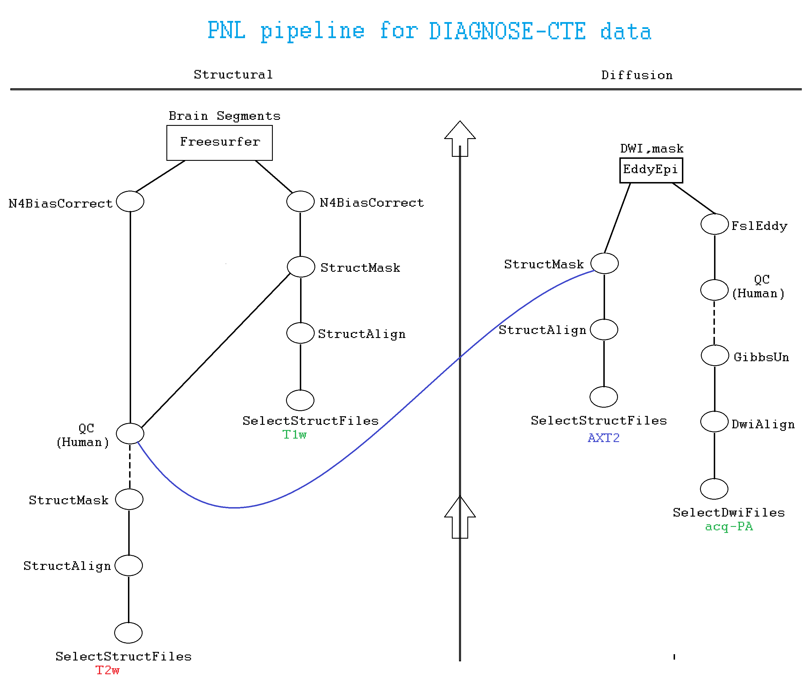
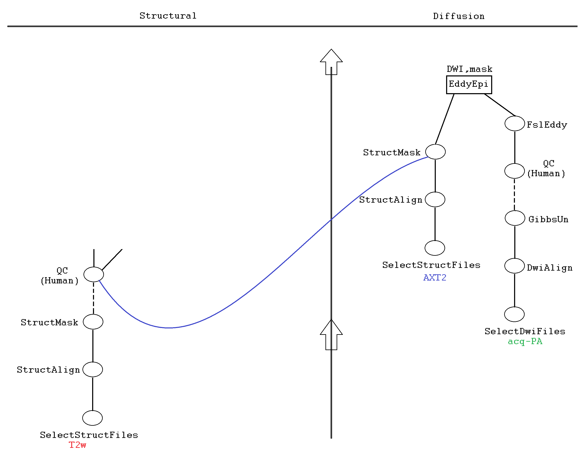
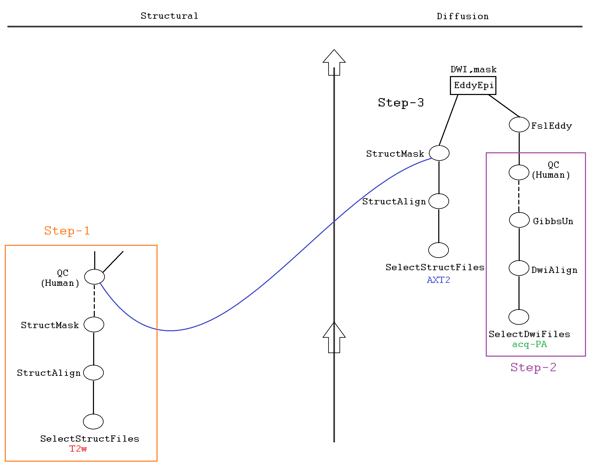

You must read [Process_HCP-EP_data.md](Process_HCP-EP_data.md) before starting off with this tutorial.

### Recap

Execution of all Luigi tasks require three things:

1. Source the proper environment e.g. bashrc3, HD-BET, CNN-Diffusion-MRIBrain-Segmentation.
2. Define the proper configuration `export LUIGI_CONFIG_PATH=/path/to/config.cfg`
3. Formulate the `/data/pnl/soft/pnlpipe3/luigi-pnlpipe/exec/ExecuteTask` command




### Structural pipeline

Its description is the same as that of HCP-EP [structural pipeline](https://github.com/pnlbwh/luigi-pnlpipe/blob/hcp/docs/Process_HCP-EP_data.md#structural-pipeline).
Instead of HD-BET, we used our good old MABS (Multi Atlas Brain Segmentation) algorithm to create T2w masks.

It is run in two steps: T2w mask creation and FreeSurfer segmentation.

* T2w mask creation

```bash
source /data/pnl/soft/pnlpipe3/bashrc3
export LUIGI_CONFIG_PATH=/data/pnl/soft/pnlpipe3/luigi-pnlpipe/params/cte/T2w_mask_params.cfg
/data/pnl/soft/pnlpipe3/luigi-pnlpipe/exec/ExecuteTask --task StructMask \
--bids-data-dir /data/pnl/DIAGNOSE_CTE_U01/rawdata \
--t2-template "sub-*/ses-01/anat/*_T2w.nii.gz" \
-c 1004 -s 01
```

* FreesSurfer segmentation

```bash
source /data/pnl/soft/pnlpipe3/bashrc3
export LUIGI_CONFIG_PATH=/data/pnl/soft/pnlpipe3/luigi-pnlpipe/params/cte/struct_pipe_params.cfg
/data/pnl/soft/pnlpipe3/luigi-pnlpipe/exec/ExecuteTask --task Freesurfer \
--bids-data-dir /data/pnl/DIAGNOSE_CTE_U01/rawdata \
--t1-template "sub-*/ses-01/anat/*_T1w.nii.gz" \
--t2-template "sub-*/ses-01/anat/*_T2w.nii.gz" \
-c 1004 -s 01
```

### Diffusion pipeline



It is run in three steps--T2w mask creation, DWI mask creation, and FSL eddy correction:



* Step-1

The T2w mask is created as part of structual pipeline. This mask is warped to the space of an axial-T2 image.
Hence, there is a line in the above flowchart going from `StructMask` (T2w) node on the left to `StructMask` (AXT2) node on the right.
The axial-T2 image is used for EPI correction.

* Step-2

DWI mask is created using our own [CNN-Diffusion-MRIBrain-Segmentation](https://github.com/pnlbwh/CNN-Diffusion-MRIBrain-Segmentation) tool.
It is a deep learning based brain extraction tool. It should be run on a GPU device i.e. `grx**` node or `bhosts gpu_hg` cluster.
To run the DWI masking program through `bhosts gpu_hg` cluster, you may use [run_gpu_mask.lsf](../workflows/run_gpu_mask.lsf) as an example.

```bash
source /data/pnl/soft/pnlpipe3/CNN-Diffusion-MRIBrain-Segmentation/train_env
export LUIGI_CONFIG_PATH=/data/pnl/soft/pnlpipe3/luigi-pnlpipe/params/cte/cnn_dwi_mask_params.cfg
/data/pnl/soft/pnlpipe3/luigi-pnlpipe/exec/ExecuteTask --task CnnMask \
--bids-data-dir /data/pnl/DIAGNOSE_CTE_U01/rawdata \
--dwi-template "sub-*/ses-01/dwi/*_dwi.nii.gz" \
-c 1004 -s 01 
```

After checking quality of the automated mask, it must be saved with `Qc` suffix in the `desc` field for its integration with later part of the diffusion pipeline. Example:

```
Automated mask  : sub-1004/ses-01/dwi/sub-1004_ses-1_desc-dwiXcUnCNN_mask.nii.gz
Quality checked : sub-1004/ses-01/dwi/sub-1004_ses-1_desc-dwiXcUnCNNQc_mask.nii.gz
```

Pay special attention to the string `CNNQc_mask.nii.gz`

* Step-3

Finally, run EDDY correction followed by EPI correction:

```bash
source /data/pnl/soft/pnlpipe3/bashrc3
export LUIGI_CONFIG_PATH=/data/pnl/soft/pnlpipe3/luigi-pnlpipe/params/cte/dwi_pipe_params.cfg
/data/pnl/soft/pnlpipe3/luigi-pnlpipe/exec/ExecuteTask --task EddyEpi \
--bids-data-dir /data/pnl/DIAGNOSE_CTE_U01/rawdata \
--dwi-template "sub-*/ses-01/dwi/*_dwi.nii.gz" \
--t2-template "sub-*/ses-01/anat/*_AXT2.nii.gz" \
-c 1004 -s 01 
```

