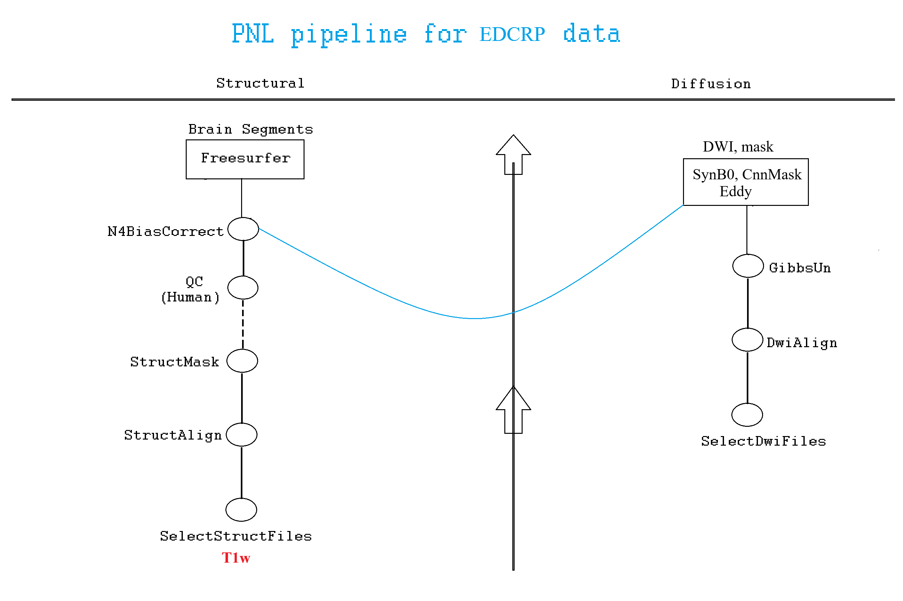
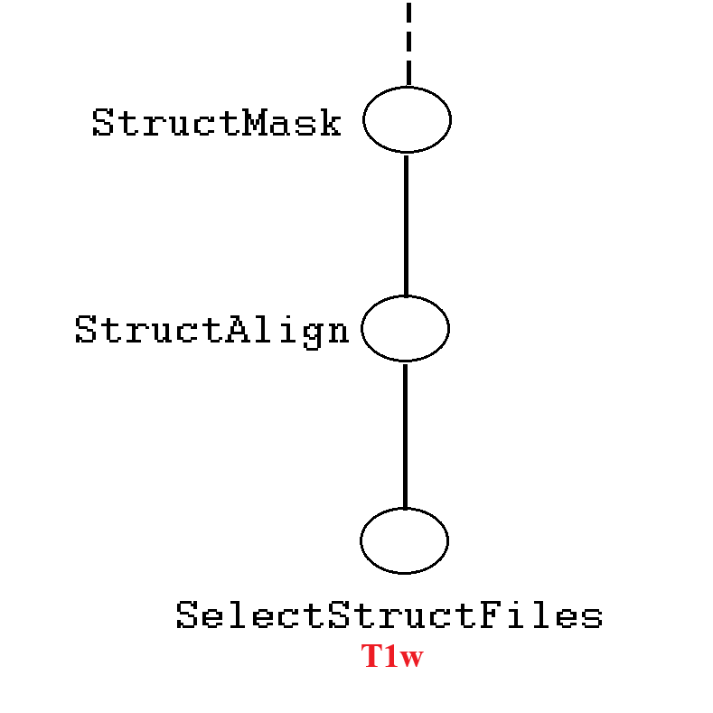
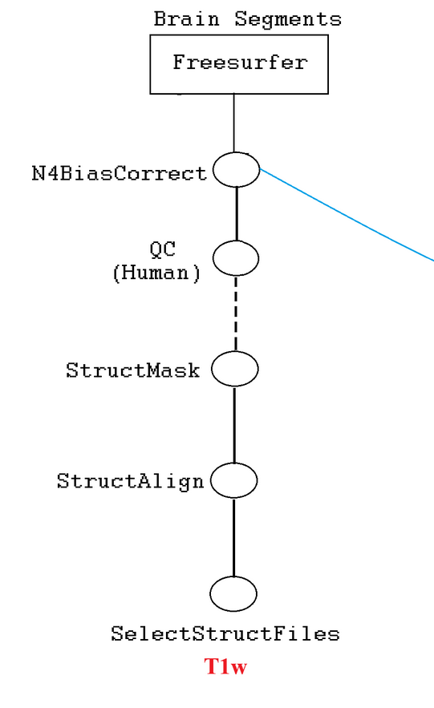
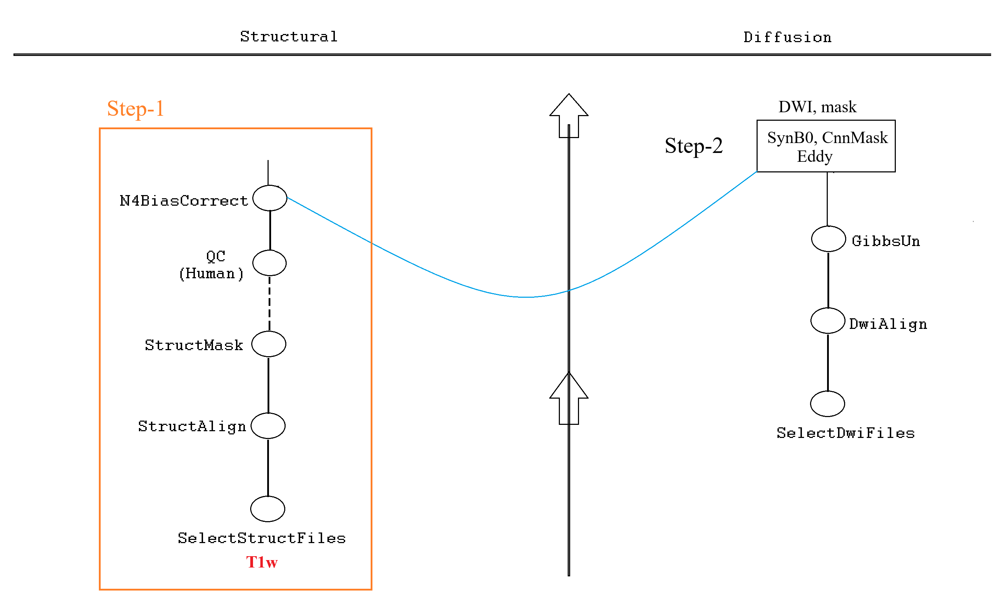
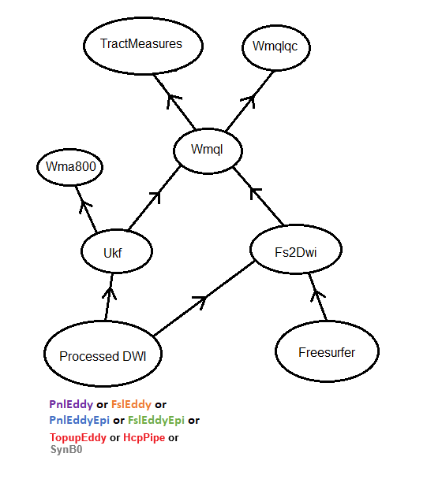

### tree command

Various folder structures shown below are generated by `tree -L 3 /path/to/directory` command. `-L 3` means upto three level deep inside `/path/to/directory`. You can adjust `-L` value according to your monitoring need. It is a useful substitute of ls command for monitoring pipeline generated outputs.

### Execution of Luigi tasks

Execution of all Luigi tasks require three things:

1. Source the proper environment e.g. bashrc9.
2. Define the proper configuration export LUIGI_CONFIG_PATH=/path/to/config.cfg
3. Formulate the /data/pnl/soft/pnlpipe9/luigi-pnlpipe/exec/ExecuteTask command


### Organize data according to BIDS

[BIDS](https://bids.neuroimaging.io/)

#### rawdata

```
BIDS
├── derivatives
└── rawdata
    ├── sub-ne00056
    │   ├── ses-01
    │   │   ├── anat
    │   │   └── dwi
    │   └── ses-02
    │       ├── anat
    │       └── dwi
    ├── sub-ne00096
    │   ├── ses-01
    │   │   ├── anat
    │   │   └── dwi
    │   └── ses-02
    │       ├── anat
    │       └── dwi
```

<details><summary>BIDS/</summary>

```python
BIDS/
├── derivatives
└── rawdata
    ├── sub-ne00056
    │   ├── ses-01
    │   │   ├── anat
    │   │   │   ├── sub-ne00056_ses-01_T1w.json
    │   │   │   └── sub-ne00056_ses-01_T1w.nii.gz
    │   │   └── dwi
    │   │       ├── sub-ne00056_ses-01_dwi.bval
    │   │       ├── sub-ne00056_ses-01_dwi.bvec
    │   │       ├── sub-ne00056_ses-01_dwi.json
    │   │       └── sub-ne00056_ses-01_dwi.nii.gz
    │   └── ses-02
    │       ├── anat
    │       └── dwi
    │           ├── sub-ne00056_ses-02_dwi.bval
    │           ├── sub-ne00056_ses-02_dwi.bvec
    │           ├── sub-ne00056_ses-02_dwi.json
    │           └── sub-ne00056_ses-02_dwi.nii.gz
    ├── sub-ne00096
    │   ├── ses-01
    │   │   ├── anat
    │   │   │   ├── sub-ne00096_ses-01_T1w.json
    │   │   │   └── sub-ne00096_ses-01_T1w.nii.gz
    │   │   └── dwi
    │   │       ├── sub-ne00096_ses-01_dwi.bval
    │   │       ├── sub-ne00096_ses-01_dwi.bvec
    │   │       ├── sub-ne00096_ses-01_dwi.json
    │   │       └── sub-ne00096_ses-01_dwi.nii.gz
    │   └── ses-02
    │       ├── anat
    │       └── dwi
    │           ├── sub-ne00096_ses-02_dwi.bval
    │           ├── sub-ne00096_ses-02_dwi.bvec
    │           ├── sub-ne00096_ses-02_dwi.json
    │           └── sub-ne00096_ses-02_dwi.nii.gz

```
  
</details>


### Structural pipeline

* T1w masking



[HD-BET](https://github.com/MIC-DKFZ/HD-BET) is a deep learning based brain extraction tool.
It should be run on a GPU device i.e. `dna007` node or `pnl-axon`.

```bash
export LUIGI_CONFIG_PATH=/data/pnl/soft/pnlpipe9/luigi-pnlpipe/params/synb0/T1w_mask.cfg
/data/pnl/soft/pnlpipe9/luigi-pnlpipe/workflows/ExecuteTask.py --task StructMask \
--bids-data-dir /data/pnlx/Collaborators/EDCRP/1034/BIDS/rawdata \
-c ne00056 -s 01 \
--t1-template "sub-*/ses-*/anat/*_T1w.nii.gz"
```

After submitting the job, go to http://pnl-elite-1.partners.org/ and monitor its status.
Its username and password are shared privately. You should also monitor logs that are printed in your terminal.
If things run successfully, you should see this summary:

```
===== Luigi Execution Summary =====

Scheduled 3 tasks of which:
* 1 complete ones were encountered:
    - 1 SelectStructFiles(...)
* 2 ran successfully:
    - 1 StructAlign(...)
    - 1 StructMask(...)

This progress looks :) because there were no failed tasks or missing dependencies

===== Luigi Execution Summary =====
```

The `-c` flag also accepts a `caselist.txt` argument where each line is a case ID:

```
ne00056
ne00060
...
```

Similarly, the `-s` flag also accepts a `sessions.txt` argument where each line is a session ID:

```
01
02
...
```


Output after HD-BET masking completes:

```python
derivatives
└── pnlpipe
    ├── sub-ne00056
    │   └── ses-01
    │       └── anat
    │           ├── sub-ne00056_ses-01_desc-T1wXcMabs_mask.nii.gz
    │           └── sub-ne00056_ses-01_desc-Xc_T1w.nii.gz
    ├── sub-ne00060
    │   └── ses-01
    │       └── anat
    │           ├── sub-ne00060_ses-01_desc-T1wXcMabs_mask.nii.gz
    │           └── sub-ne00060_ses-01_desc-Xc_T1w.nii.gz

```


* Quality checking T1w mask

*(Not yet done)*

Quality checked mask must be saved with Qc suffix in the desc field for its integration with later part of the structural pipeline. Example:

```
Automated mask  : sub-ne00056/ses-01/anat/sub-ne00056_ses-01_desc-T1wXcMabs_mask.nii.gz
Quality checked : sub-ne00056/ses-01/anat/sub-ne00056_ses-01_desc-T1wXcMabsQc_mask.nii.gz
```

* FreeSurfer segmentation

*(Not yet done)*



```bash
export LUIGI_CONFIG_PATH=/data/pnl/soft/pnlpipe9/luigi-pnlpipe/params/synb0/T1w_mask.cfg
/data/pnl/soft/pnlpipe9/luigi-pnlpipe/workflows/ExecuteTask.py --task Freesurfer \
--bids-data-dir /data/pnlx/Collaborators/EDCRP/1034/BIDS/rawdata \
-c ne00056 -s 01 \
--t1-template "sub-*/ses-*/anat/*_T1w.nii.gz"
```


### Diffusion pipeline



Diffusion pipeline is less straightforward to run than structural pipeline because of the SynB0 black box involved. The black box uses slightly modified https://github.com/MASILab/Synb0-DISCO. To allow preceding and following steps to be run by Luigi pipeline, please use `ExecuteTask.py --task SynB0` for running the diffusion pipeline:


It is run in two steps: T1w mask creation and SynB0

* Step-1

Instruction for this step is given above. After quality checking of T1w mask, you can proceed to the next step.

* Step-2

```bash
export LUIGI_CONFIG_PATH=/data/pnlx/Collaborators/EDCRP/1034/BIDS/dwi_pipe_params.cfg
/data/pnl/soft/pnlpipe9/luigi-pnlpipe/workflows/ExecuteTask.py --task SynB0 \
--bids-data-dir /data/pnlx/Collaborators/EDCRP/1034/BIDS/rawdata \
-c ne00056 -s 01 \
--dwi-template "sub-*/ses-*/dwi/*_dwi.nii.gz"
--t1-template "sub-*/ses-*/anat/*_T1w.nii.gz"
```

Mask of the distortion corrected b0 is created under the hood using our own [CNN-Diffusion-MRIBrain-Segmentation](https://github.com/pnlbwh/CNN-Diffusion-MRIBrain-Segmentation) tool.
It is a deep learning based brain extraction tool. Therefore, this pipeline should be run on a GPU device.

Output after `SynB0` completes:

```
BIDS
└── derivatives
    └── pnlpipe
        ├── sub-ne00056
            └── ses-01
                ├── anat
                │   ├── sub-ne00056_ses-01_desc-T1wXcMabs_mask.nii.gz
                │   ├── sub-ne00056_ses-01_desc-XcMaN4_T1w.nii.gz
                │   ├── sub-ne00056_ses-01_desc-XcMa_T1w.nii.gz
                │   └── sub-ne00056_ses-01_desc-Xc_T1w.nii.gz
                ├── dwi
                │   ├── sub-ne00056_ses-01_desc-dwiXcUn_bse.nii.gz
                │   ├── sub-ne00056_ses-01_desc-dwiXcUnCNN_mask.nii.gz
                │   ├── sub-ne00056_ses-01_desc-dwiXcUnEdEp_bse.nii.gz
                │   ├── sub-ne00056_ses-01_desc-dwiXcUnEdEp_mask.nii.gz
                │   ├── sub-ne00056_ses-01_desc-Xc_dwi.bval
                │   ├── sub-ne00056_ses-01_desc-Xc_dwi.bvec
                │   ├── sub-ne00056_ses-01_desc-Xc_dwi.nii.gz
                │   ├── sub-ne00056_ses-01_desc-XcUn_dwi.bval
                │   ├── sub-ne00056_ses-01_desc-XcUn_dwi.bvec
                │   ├── sub-ne00056_ses-01_desc-XcUn_dwi.nii.gz
                │   ├── sub-ne00056_ses-01_desc-XcUnEdEp_dwi.bval
                │   ├── sub-ne00056_ses-01_desc-XcUnEdEp_dwi.bvec
                │   └── sub-ne00056_ses-01_desc-XcUnEdEp_dwi.nii.gz
                ├── INPUTS
                │   ├── ...
                │   ├── ...
                └── OUTPUTS
                    ├── ...
                    ├── ...

```


### Appendix

#### Higher level tasks



#### Troubleshooting

https://github.com/pnlbwh/luigi-pnlpipe/blob/hcp/docs/Process_HCP-EP_data.md#troubleshooting

#### More resources

* Background of Luigi: [README.md](README.md)
* Advanced documentation: [TUTORIAL.md](TUTORIAL.md)


