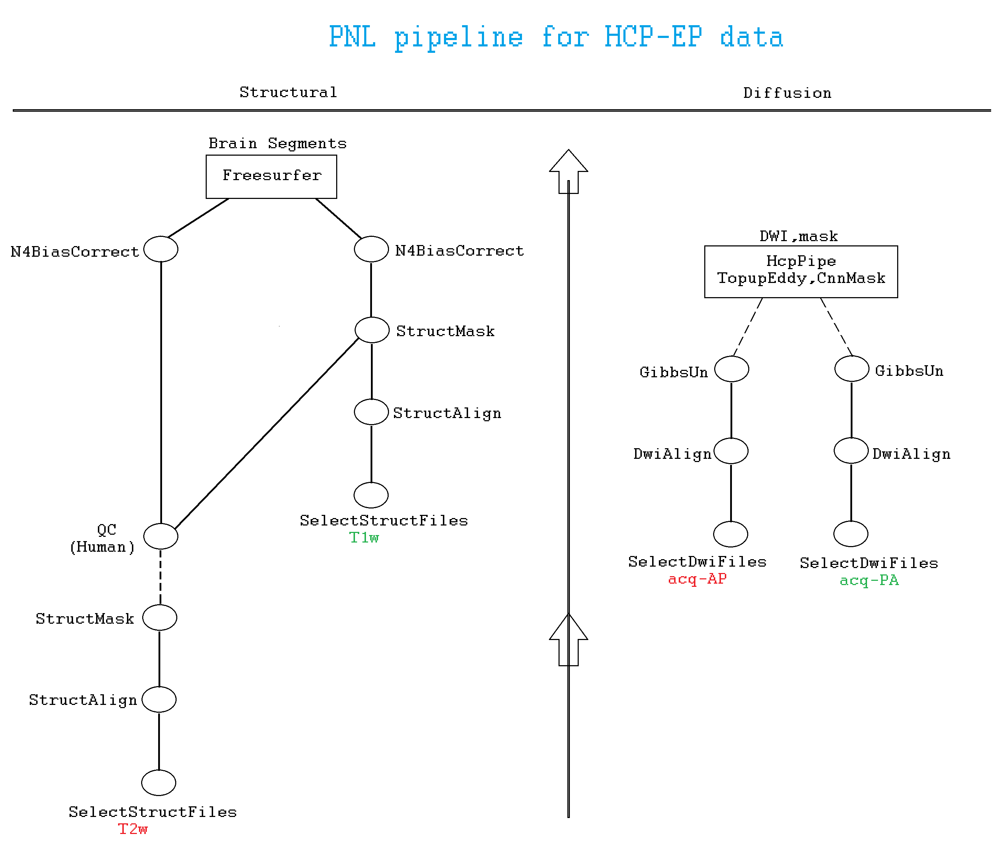
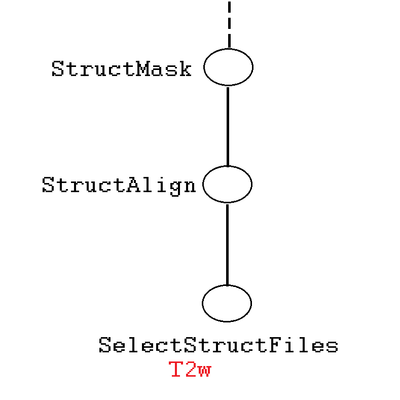
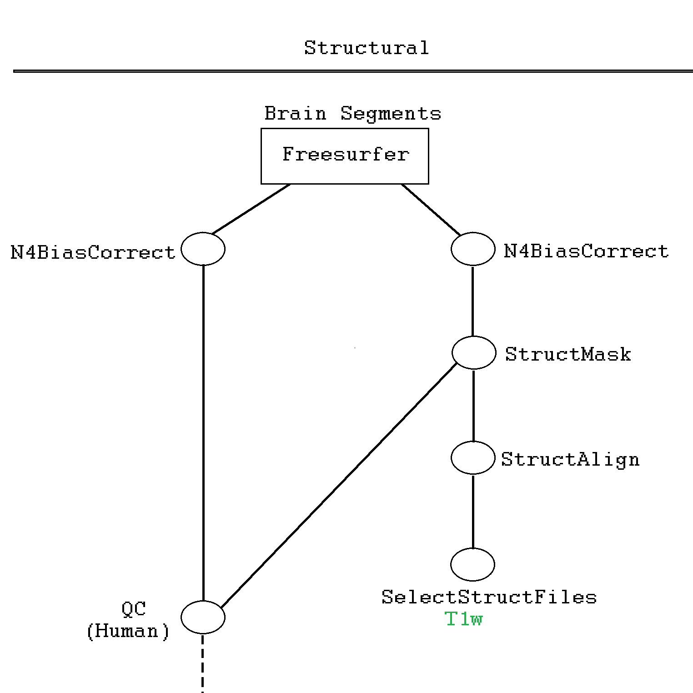
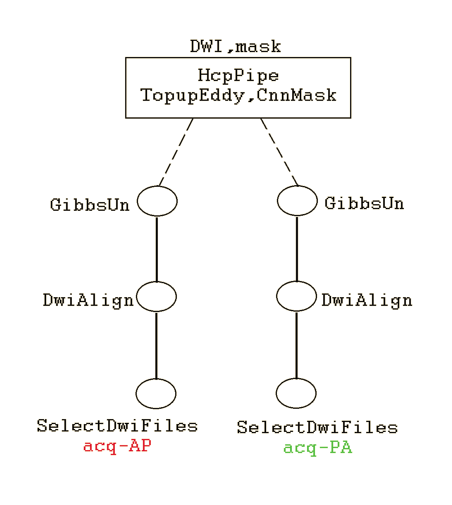
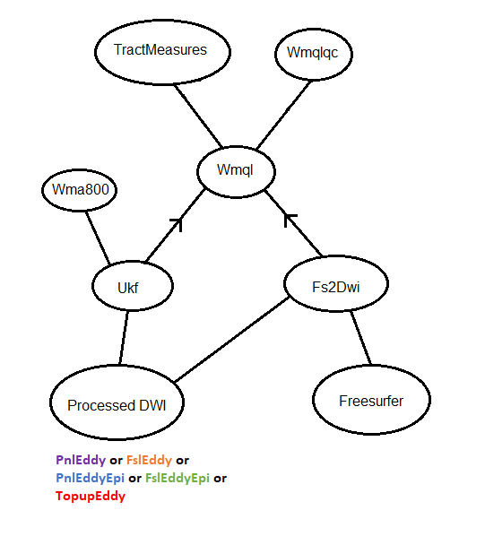
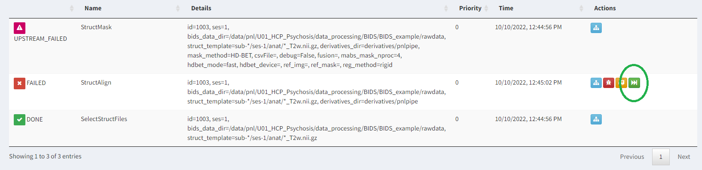

---

### Table of Contents

 * [Why do we need Luigi?](#why-do-we-need-luigi)
 * [Prologue](#prologue)
 * [Structural pipeline](#structural-pipeline)
 * [Diffusion pipeline](#diffusion-pipeline)
 * [Higher level tasks](#higher-level-tasks)
 * [Troubleshooting](#troubleshooting)


### Why do we need Luigi?

* It has streamlined tasks execution
* It generates [logs](https://github.com/pnlbwh/luigi-pnlpipe/blob/hcp/docs/README.md#pnl-luigi-server) that can be used in future to reproduce results
* It provides a nice dashboard for monitoring tasks' progress
* It yields organized output
* Above all, it allows everyone to use one central workflow


### Prologue

#### Access to gpu_hg cluster

New RAs may not have been added to [eristwo.partners.org]()'s `gpu_hg` cluster. To run diffusion pipeline on mulitple cases parallely, you need access to
`gpu_hg` cluster. You should email `hpcsupport[at]partners[dot]org` and copy `yogesh[at]bwh[dot]harvard[dot]edu` requesting access.

#### tree command

Various folder structures shown below are generated by `tree -L 3 /path/to/directory` command.
`-L 3` means upto three level deep inside `/path/to/directory`. You can adjust `-L` value according
to your monitoring need. It is a useful substitute of `ls` command for monitoring pipeline generated outputs.

#### Execution of Luigi tasks
Execution of all Luigi tasks require three things:

1. Source the proper environment e.g. bashrc3, HD-BET, CNN-Diffusion-MRIBrain-Segmentation.
2. Define the proper configuration `export LUIGI_CONFIG_PATH=/path/to/config.cfg`
3. Formulate the `/data/pnl/soft/pnlpipe3/luigi-pnlpipe/exec/ExecuteTask` command


#### Organize data according to BIDS

[BIDS](https://bids.neuroimaging.io/)

> cd /data/pnl/U01_HCP_Psychosis/data_processing

```python
BIDS/
├── derivatives
└── rawdata

BIDS/
├── derivatives
└── rawdata
    ├── sub-1003
    └── sub-1004
    
BIDS/
├── derivatives
└── rawdata
    ├── sub-1003
    │   └── ses-1
    └── sub-1004
        └── ses-1
        
BIDS/
├── derivatives
└── rawdata
    ├── sub-1003
    │   └── ses-1
    │       ├── anat
    │       ├── dwi
    │       └── func
    └── sub-1004
        └── ses-1
            ├── anat
            ├── dwi
            └── func

```

<details><summary>BIDS/</summary>

```python
BIDS/
├── derivatives
└── rawdata
    ├── sub-1003
    │   └── ses-1
    │       ├── anat
    │       │   ├── sub-1003_ses-1_T1w.nii.gz
    │       │   └── sub-1003_ses-1_T2w.nii.gz
    │       ├── dwi
    │       │   ├── sub-1003_ses-1_acq-AP_dir-98_dwi.bval
    │       │   ├── sub-1003_ses-1_acq-AP_dir-98_dwi.bvec
    │       │   ├── sub-1003_ses-1_acq-AP_dir-98_dwi.nii.gz
    │       │   ├── sub-1003_ses-1_acq-PA_dir-98_dwi.bval
    │       │   ├── sub-1003_ses-1_acq-PA_dir-98_dwi.bvec
    │       │   └── sub-1003_ses-1_acq-PA_dir-98_dwi.nii.gz
    │       └── func
    │           ├── sub-1003_ses-1_task-rest_acq-AP_run-1_bold.json
    │           ├── sub-1003_ses-1_task-rest_acq-AP_run-1_bold.nii.gz
    │           ├── sub-1003_ses-1_task-rest_acq-AP_run-2_bold.json
    │           ├── sub-1003_ses-1_task-rest_acq-AP_run-2_bold.nii.gz
    │           ├── sub-1003_ses-1_task-rest_acq-PA_run-1_bold.json
    │           ├── sub-1003_ses-1_task-rest_acq-PA_run-1_bold.nii.gz
    │           ├── sub-1003_ses-1_task-rest_acq-PA_run-2_bold.json
    │           └── sub-1003_ses-1_task-rest_acq-PA_run-2_bold.nii.gz
    └── sub-1004
        └── ses-1
            ├── anat
            │   ├── sub-1004_ses-1_T1w.nii.gz
            │   └── sub-1004_ses-1_T2w.nii.gz
            ├── dwi
            │   ├── sub-1004_ses-1_acq-AP_dir-98_dwi.bval
            │   ├── sub-1004_ses-1_acq-AP_dir-98_dwi.bvec
            │   ├── sub-1004_ses-1_acq-AP_dir-98_dwi.nii.gz
            │   ├── sub-1004_ses-1_acq-AP_dir-99_dwi.bval
            │   ├── sub-1004_ses-1_acq-AP_dir-99_dwi.bvec
            │   ├── sub-1004_ses-1_acq-AP_dir-99_dwi.json
            │   ├── sub-1004_ses-1_acq-AP_dir-99_dwi.nii.gz
            │   ├── sub-1004_ses-1_acq-PA_dir-98_dwi.bval
            │   ├── sub-1004_ses-1_acq-PA_dir-98_dwi.bvec
            │   ├── sub-1004_ses-1_acq-PA_dir-98_dwi.nii.gz
            │   ├── sub-1004_ses-1_acq-PA_dir-99_dwi.bval
            │   ├── sub-1004_ses-1_acq-PA_dir-99_dwi.bvec
            │   ├── sub-1004_ses-1_acq-PA_dir-99_dwi.json
            │   └── sub-1004_ses-1_acq-PA_dir-99_dwi.nii.gz
            └── func
                ├── sub-1004_ses-1_task-rest_acq-AP_run-1_bold.json
                ├── sub-1004_ses-1_task-rest_acq-AP_run-1_bold.nii.gz
                ├── sub-1004_ses-1_task-rest_acq-AP_run-2_bold.json
                ├── sub-1004_ses-1_task-rest_acq-AP_run-2_bold.nii.gz
                ├── sub-1004_ses-1_task-rest_acq-PA_run-1_bold.json
                ├── sub-1004_ses-1_task-rest_acq-PA_run-1_bold.nii.gz
                ├── sub-1004_ses-1_task-rest_acq-PA_run-2_bold.json
                └── sub-1004_ses-1_task-rest_acq-PA_run-2_bold.nii.gz
```
  
</details>


### Structural pipeline

* T2w masking



[HD-BET](https://github.com/MIC-DKFZ/HD-BET) is a deep learning based brain extraction tool.
It should be run on a GPU device i.e. `grx**` node or `bhosts gpu_hg` cluster.

```bash
source /data/pnl/soft/pnlpipe3/HD-BET/env.sh
export LUIGI_CONFIG_PATH=/data/pnl/soft/pnlpipe3/luigi-pnlpipe/params/hcp/T2w_mask.cfg
/data/pnl/soft/pnlpipe3/luigi-pnlpipe/exec/ExecuteTask --task StructMask \
--bids-data-dir /data/pnl/soft/pnlpipe3/luigi-pnlpipe/BIDS/rawdata \
-c 1003 -s 1 \
--t2-template "sub-*/ses-1/anat/*_T2w.nii.gz"
```

The above commands are noted in [run_gpu_mask.lsf](../workflows/run_gpu_mask.lsf) for your convenience.

After submitting the job, go to https://pnlservers.bwh.harvard.edu/luigi/ and monitor its status.
Its username and password are shared privately. You should also monitor logs that are printed in your terminal.
If things run successfully, you should see this summary:

```
===== Luigi Execution Summary =====

Scheduled 3 tasks of which:
* 1 complete ones were encountered:
    - 1 SelectStructFiles(id=1003, ses=1, bids_data_dir=/data/pnl/U01_HCP_Psychosis/data_processing/BIDS/BIDS_example/rawdata, struct_template=sub-*/ses-1/anat/*_T2w.nii.gz)
* 2 ran successfully:
    - 1 StructAlign(id=1003, ses=1, bids_data_dir=/data/pnl/U01_HCP_Psychosis/data_processing/BIDS/BIDS_example/rawdata, struct_template=sub-*/ses-1/anat/*_T2w.nii.gz, derivatives_dir=derivatives/pnlpipe)
    - 1 StructMask(...)

This progress looks :) because there were no failed tasks or missing dependencies

===== Luigi Execution Summary =====
```

The `-c` flag also accepts a `caselist.txt` argument where each line is a case ID:

```
1003
1004
...
```

Similarly, the `-s` flag also accepts a `sessions.txt` argument where each line is a session ID:

```
1
2
...
```

Some of you have access to `bhosts gpu_hg` cluster where HD-BET could be run. We shall teach you
how to optimize the number of parallel cases you can mask on the cluster at a later date.


Output after HD-BET masking completes:

```python
derivatives/
└── pnlpipe
    ├── sub-1003
    │   └── ses-1
    │       └── anat
    └── sub-1004
        └── ses-1
            └── anat

```

```python
derivatives/
└── pnlpipe
    ├── sub-1003
    │   └── ses-1
    │       └── anat
    │           ├── sub-1003_ses-1_desc-T2wXcMabs_mask.nii.gz
    │           └── sub-1003_ses-1_desc-Xc_T2w.nii.gz
    └── sub-1004
        └── ses-1
            └── anat
                ├── sub-1004_ses-1_desc-T2wXcMabs_mask.nii.gz
                └── sub-1004_ses-1_desc-Xc_T2w.nii.gz

```


* Quality checking T2w mask

Quality checked mask must be saved with Qc suffix in the desc field for its integration with later part of the structural pipeline. Example:

```
Automated mask  : sub-1003/ses-1/anat/sub-1003_ses-1_desc-T2wXcMabs_mask.nii.gz
Quality checked : sub-1003/ses-1/anat/sub-1003_ses-1_desc-T2wXcMabsQc_mask.nii.gz
```


```python
derivatives/
└── pnlpipe
    ├── sub-1003
    │   └── ses-1
    │       └── anat
    │           ├── sub-1003_ses-1_desc-T2wXcMabs_mask.nii.gz
    |           ├── sub-1003_ses-1_desc-T2wXcMabsQc_mask.nii.gz
    │           └── sub-1003_ses-1_desc-Xc_T2w.nii.gz
    └── sub-1004
        └── ses-1
            └── anat
                ├── sub-1004_ses-1_desc-T2wXcMabs_mask.nii.gz
                ├── sub-1004_ses-1_desc-T2wXcMabsQc_mask.nii.gz
                └── sub-1004_ses-1_desc-Xc_T2w.nii.gz

```


* FreeSurfer segmentation



For HCP-EP data, we have created HD-BET mask for T2w images. Then we have warped them to obtain mask for T1w images.
Hence there is a line from `QC (Human)` to `StructMask` node in the above diagram.
This approach minimizes the human effort required to quality check masks for all modalities.
Nevertheless, you can create HD-BET mask for all modalities and quality check them manually.
Both T1w and T2w images are necessary for performing FreeSurfer segmentation. For this `Freesurfer` task,
use the following environment and configuration:


```bash
source /data/pnl/soft/pnlpipe3/bashrc3
export LUIGI_CONFIG_PATH=/data/pnl/soft/pnlpipe3/luigi-pnlpipe/params/hcp/struct_pipe_params.cfg
/data/pnl/soft/pnlpipe3/luigi-pnlpipe/exec/ExecuteTask --task Freesurfer \
--bids-data-dir /data/pnl/U01_HCP_Psychosis/data_processing/BIDS/rawdata \
-c 1003 -s 1 \
--t2-template "sub-*/ses-1/anat/*_T2w.nii.gz" \
--t1-template "sub-*/ses-1/anat/*_T1w.nii.gz"
```

The above commands are assemblednoted in [run_luigi_pnlpipe.lsf](../workflows/run_luigi_pnlpipe.lsf) for your convenience.
A few parameters of the above configuration file demands explanation:

```
[DEFAULT]
reg_method: rigid

[StructMask]

[Freesurfer]
t1_mask_method: registration
t1_ref_img: *_desc-Xc_T2w.nii.gz
t1_ref_mask: *_desc-T2wXcMabsQc_mask.nii.gz

t2_mask_method: HD-BET
```

Notice the difference of values between `t2_mask_method` and `t1_mask_method`. Also notice the values of `ref_img` and `ref_mask` beginning with asterisk (`*`). The asterisk (`*`) is important. These are the patterns with which output directory is searched to obtain T2w image and associated HD-BET mask. The T2w image is used to register to target space, in this case T1w space. Finally, the associated HD-BET mask is warped to target space. Another important parameter is `reg_method`. It takes a value of either `rigid` or `SyN` indicating the type of ANTs registration you would like to perform. `rigid` is quick and sufficient for this setting. `SyN` is time consuming and can be more accurate.

`NOTE` There is a modality mismatch between the parameter name `t1_ref_img` and its value `*_desc-Xc_T2w.nii.gz`. It came from the convention ANTs follows. It means--to create a T1w mask, use the T2w mask as the reference image.


After `Freesurfer` task completes, the will look like:

<details><summary>derivatives/</summary>

```python
derivatives/
└── pnlpipe
    ├── sub-1003
    │   └── ses-1
    │       └── anat
    │           ├── fs7.1.0
    │           │   ├── label
    │           │   ├── mri
    │           │   ├── scripts
    │           │   ├── stats
    │           │   ├── surf
    │           │   ├── tmp
    │           │   ├── touch
    │           │   ├── trash
    │           │   └── version.txt
    │           ├── sub-1003_ses-1_desc-T2wXcMabsQc_mask.nii.gz
    │           ├── sub-1003_ses-1_desc-T2wXcMabsQcToT1wXc_mask.nii.gz
    │           ├── sub-1003_ses-1_desc-XcMaN4_T1w.nii.gz
    │           ├── sub-1003_ses-1_desc-XcMaN4_T2w.nii.gz
    │           ├── sub-1003_ses-1_desc-XcMa_T1w.nii.gz
    │           ├── sub-1003_ses-1_desc-XcMa_T2w.nii.gz
    │           ├── sub-1003_ses-1_desc-Xc_T1w.nii.gz
    │           └── sub-1003_ses-1_desc-Xc_T2w.nii.gz
    └── sub-1004
        └── ses-1
            └── anat
                ├── fs7.1.0
                │   ├── label
                │   ├── mri
                │   ├── scripts
                │   ├── stats
                │   ├── surf
                │   ├── tmp
                │   ├── touch
                │   ├── trash
                │   └── version.txt
                ├── sub-1004_ses-1_desc-T2wXcMabsQc_mask.nii.gz
                ├── sub-1004_ses-1_desc-T2wXcMabsQcToT1wXc_mask.nii.gz
                ├── sub-1004_ses-1_desc-XcMaN4_T1w.nii.gz
                ├── sub-1004_ses-1_desc-XcMaN4_T2w.nii.gz
                ├── sub-1004_ses-1_desc-XcMa_T1w.nii.gz
                ├── sub-1004_ses-1_desc-XcMa_T2w.nii.gz
                ├── sub-1004_ses-1_desc-Xc_T1w.nii.gz
                └── sub-1004_ses-1_desc-Xc_T2w.nii.gz

```

</details>


### Diffusion pipeline

Diffusion pipeline is less straightforward to run than structural pipeline because of the `HcpPipe` black box involved.
The black box uses slightly modified [Washington-University/HCPpipelines](https://github.com/pnlbwh/HCPpipelines).
To allow preceding and following steps to be run by Luigi pipeline, please use [hcp_pnl_topup.lsf](../workflows/hcp_pnl_topup.lsf) script
to run the diffusion pipeline:



Preceding steps are until Gibb's unringing (`GibsUn`) and following step is soft link creation so all outputs are available at the parent directory:

```python
dwi
├── hcppipe
│   ├── Diffusion
│   │   ├── data
│   │   ├── eddy
│   │   ├── reg
│   │   └── topup
│   └── T1w
│       └── Diffusion
├── sub-*_ses-1_dir-*_desc-dwiXcUnEdEp_mask.nii.gz -> hcppipe/Diffusion/eddy/nodif_brain_mask.nii.gz
├── sub-*_ses-1_dir-*_desc-XcUnEdEp_dwi.bval -> hcppipe/Diffusion/eddy/Pos_Neg.bvals
├── sub-*_ses-1_dir-*_desc-XcUnEdEp_dwi.bvec -> hcppipe/Diffusion/eddy/eddy_unwarped_images.eddy_rotated_bvecs
└── sub-*_ses-1_dir-*_desc-XcUnEdEp_dwi.nii.gz -> hcppipe/Diffusion/eddy/eddy_unwarped_images.nii.gz
```

* Copy `/data/pnl/soft/pnlpipe3/luigi-pnlpipe/workflows/hcp_pnl_topup.lsf` to your preferred directory
* Edit it for your data
* **get your edits approved by the PNL engineer in charge**
* Run the pipeline as: `bsub < /path/to/hcp_pnl_topup.lsf`

<details><summary>You should need to edit only this segment:</summary>

```bash
# ==============================================================================
bids_data_dir=/data/pnl/U01_HCP_Psychosis/data_processing/BIDS/rawdata

# write four templates in the following order
# PA template, PA template
# AP template, AP template
raw_template="sub-*/ses-1/dwi/*_ses-1_acq-PA_dir-99_dwi.nii.gz sub-*/ses-1/dwi/*_ses-1_acq-PA_dir-98_dwi.nii.gz \
              sub-*/ses-1/dwi/*_ses-1_acq-AP_dir-99_dwi.nii.gz sub-*/ses-1/dwi/*_ses-1_acq-AP_dir-98_dwi.nii.gz"
unr_template="*_ses-1_acq-PA_dir-99_desc-XcUn_dwi.nii.gz *_ses-1_acq-PA_dir-107_desc-XcUn_dwi.nii.gz \
              *_ses-1_acq-AP_dir-99_desc-XcUn_dwi.nii.gz *_ses-1_acq-AP_dir-107_desc-XcUn_dwi.nii.gz"

# a single caseid or a text file with list of cases
caselist=/path/to/caselist.txt

LUIGI_CONFIG_PATH=/data/pnl/soft/pnlpipe3/luigi-pnlpipe/params/hcp/dwi_pipe_params.cfg

# task is one of {HcpPipe,Ukf,Wma800}
task=HcpPipe

#BSUB -J hcp-topup[1-N]%2
#BSUB -q gpu
#BSUB -m ml001
#BSUB -R rusage[mem=12000]
#BSUB -o /data/pnl/U01_HCP_Psychosis/data_processing/output/hcp-topup-%J-%I.out
#BSUB -e /data/pnl/U01_HCP_Psychosis/data_processing/output/hcp-topup-%J-%I.err
#BSUB -n 4
    
export CUDA_VISIBLE_DEVICES=$(( ${LSB_JOBINDEX}%2 ))
# ==============================================================================

```

</details>    
    
<details><summary>Way to change [1-N]%2 and BSUB -n 4</summary>

The formula for `CUDA_VISIBLE_DEVICES` is `${LSB_JOBINDEX}%G`,
which also means the maximum number of parallel cases you can process is G

Adjust `BSUB -n 4` in a way that each GPU device can run no more than one job.
You can use the formula "BSUB -n N/G" to ensure that where--

* N is the maximum number of jobs for that node
* G is the number of GPUs in that node

Otherwise your jobs might crash due to out of memory error.

Example: node ml001 has 8(=N) job slots and 2(=G) GPUs so "BSUB -n 8/2" and "BSUB -J hcp-topup[1-N]%2"

</details>


<details><summary>derivatives/pnlpipe/sub-1004/ses-1/dwi/</summary>
    
```python
sub-1004
└── ses-1
    ├── anat
    .
    .
    └── dwi
        ├── hcppipe
        │   ├── Diffusion
        │   │   ├── data
        │   │   ├── eddy
        │   │   ├── reg
        │   │   └── topup
        │   └── T1w
        │       └── Diffusion
        ├── sub-1004_ses-1_acq-AP_dir-98_desc-Xc_dwi.bval
        ├── sub-1004_ses-1_acq-AP_dir-98_desc-Xc_dwi.bvec
        ├── sub-1004_ses-1_acq-AP_dir-98_desc-Xc_dwi.log.html
        ├── sub-1004_ses-1_acq-AP_dir-98_desc-Xc_dwi.log.json
        ├── sub-1004_ses-1_acq-AP_dir-98_desc-Xc_dwi.nii.gz
        ├── sub-1004_ses-1_acq-AP_dir-98_desc-XcUn_dwi.bval
        ├── sub-1004_ses-1_acq-AP_dir-98_desc-XcUn_dwi.bvec
        ├── sub-1004_ses-1_acq-AP_dir-98_desc-XcUn_dwi.log.html
        ├── sub-1004_ses-1_acq-AP_dir-98_desc-XcUn_dwi.log.json
        ├── sub-1004_ses-1_acq-AP_dir-98_desc-XcUn_dwi.nii.gz
        ├── sub-1004_ses-1_acq-AP_dir-99_desc-Xc_dwi.bval
        ├── sub-1004_ses-1_acq-AP_dir-99_desc-Xc_dwi.bvec
        ├── sub-1004_ses-1_acq-AP_dir-99_desc-Xc_dwi.log.html
        ├── sub-1004_ses-1_acq-AP_dir-99_desc-Xc_dwi.log.json
        ├── sub-1004_ses-1_acq-AP_dir-99_desc-Xc_dwi.nii.gz
        ├── sub-1004_ses-1_acq-AP_dir-99_desc-XcUn_dwi.bval
        ├── sub-1004_ses-1_acq-AP_dir-99_desc-XcUn_dwi.bvec
        ├── sub-1004_ses-1_acq-AP_dir-99_desc-XcUn_dwi.log.html
        ├── sub-1004_ses-1_acq-AP_dir-99_desc-XcUn_dwi.log.json
        ├── sub-1004_ses-1_acq-AP_dir-99_desc-XcUn_dwi.nii.gz
        ├── sub-1004_ses-1_acq-PA_dir-98_desc-Xc_dwi.bval
        ├── sub-1004_ses-1_acq-PA_dir-98_desc-Xc_dwi.bvec
        ├── sub-1004_ses-1_acq-PA_dir-98_desc-Xc_dwi.log.html
        ├── sub-1004_ses-1_acq-PA_dir-98_desc-Xc_dwi.log.json
        ├── sub-1004_ses-1_acq-PA_dir-98_desc-Xc_dwi.nii.gz
        ├── sub-1004_ses-1_acq-PA_dir-98_desc-XcUn_dwi.bval
        ├── sub-1004_ses-1_acq-PA_dir-98_desc-XcUn_dwi.bvec
        ├── sub-1004_ses-1_acq-PA_dir-98_desc-XcUn_dwi.log.html
        ├── sub-1004_ses-1_acq-PA_dir-98_desc-XcUn_dwi.log.json
        ├── sub-1004_ses-1_acq-PA_dir-98_desc-XcUn_dwi.nii.gz
        ├── sub-1004_ses-1_acq-PA_dir-99_desc-Xc_dwi.bval
        ├── sub-1004_ses-1_acq-PA_dir-99_desc-Xc_dwi.bvec
        ├── sub-1004_ses-1_acq-PA_dir-99_desc-Xc_dwi.log.html
        ├── sub-1004_ses-1_acq-PA_dir-99_desc-Xc_dwi.log.json
        ├── sub-1004_ses-1_acq-PA_dir-99_desc-Xc_dwi.nii.gz
        ├── sub-1004_ses-1_acq-PA_dir-99_desc-XcUn_dwi.bval
        ├── sub-1004_ses-1_acq-PA_dir-99_desc-XcUn_dwi.bvec
        ├── sub-1004_ses-1_acq-PA_dir-99_desc-XcUn_dwi.log.html
        ├── sub-1004_ses-1_acq-PA_dir-99_desc-XcUn_dwi.log.json
        ├── sub-1004_ses-1_acq-PA_dir-99_desc-XcUn_dwi.nii.gz
        ├── sub-1004_ses-1_dir-398_desc-dwiXcUnEdEp_mask.nii.gz -> hcppipe/Diffusion/eddy/nodif_brain_mask.nii.gz
        ├── sub-1004_ses-1_dir-398_desc-XcUnEdEp_dwi.bval -> hcppipe/Diffusion/eddy/Pos_Neg.bvals
        ├── sub-1004_ses-1_dir-398_desc-XcUnEdEp_dwi.bvec -> hcppipe/Diffusion/eddy/eddy_unwarped_images.eddy_rotated_bvecs
        └── sub-1004_ses-1_dir-398_desc-XcUnEdEp_dwi.nii.gz -> hcppipe/Diffusion/eddy/eddy_unwarped_images.nii.gz

```
    
</details>


### Higher level tasks




### Troubleshooting

* [Incorrect template](#incorrect-template)
* [Incorrect mask name](#incorrect-mask-name)
* [How to resume a failed pipeline](#how-to-resume-a-failed-pipeline)
* [How to force repeat a pipeline](#how-to-force-repeat-a-pipeline)


You should read through your terminal logs to pinpoint the error. If you execute tasks through LSF, you should read through
both `*out` and `*err` logs. Just `*err` file may not be enough. If Luigi tasks fail, you will see this message in your logs:

> This progress looks :( because there were tasks whose scheduling failed

We describe some common errors below:

#### Incorrect template

```bash
  File "luigi-pnlpipe/workflows/_glob.py", line 23, in _glob
    raise FileNotFoundError(f'No file found using the template {template}\n'
FileNotFoundError: No file found using the template /data/pnl/U01_HCP_Psychosis/data_processing/BIDS/BIDS_example/rawdata/sub-1003/ses-1/*_T2w.nii.gz
Correct the bids-data-dir and/or template and try again
...
...
===== Luigi Execution Summary =====

Scheduled 1 tasks of which:
* 1 failed scheduling:
    - 1 StructMask(...)

Did not run any tasks
This progress looks :( because there were tasks whose scheduling failed
```

Copy the reported template and `ls` directly in your terminal:

```bash
$ ls /data/pnl/U01_HCP_Psychosis/data_processing/BIDS/BIDS_example/rawdata/sub-1003/ses-1/*_T2w.nii.gz
ls: cannot access /data/pnl/U01_HCP_Psychosis/data_processing/BIDS/BIDS_example/rawdata/sub-1003/ses-1/*_T2w.nii.gz: No such file or directory
```

As you see, the template was indeed wrong. Instead of `sub-1003/ses-1/*_T2w.nii.gz`, it should have been `sub-1003/ses-1/anat/*_T2w.nii.gz`.


#### Incorrect mask name

```
Quality checked mask not found
Check the quality of created mask /data/pnl/U01_HCP_Psychosis/data_processing/BIDS/BIDS_example/derivatives/pnlpipe/sub-1003/ses-1/anat/sub-1003_ses-1_desc-T2wXcMabs_mask.nii.gz
Once you are done, save the (edited) mask as /data/pnl/U01_HCP_Psychosis/data_processing/BIDS/BIDS_example/derivatives/pnlpipe/sub-1003/ses-1/anat/sub-1003_ses-1_desc-T2wXcMabsQc_mask.nii.gz
```

If you see the above error, you either have not quality checked the mask or saved it with the appropirate name. You can confrm the error just by listing the file in your terminal:

```bash
$ ls /data/pnl/U01_HCP_Psychosis/data_processing/BIDS/BIDS_example/derivatives/pnlpipe/sub-1003/ses-1/anat/sub-1003_ses-1_desc-T2wXcMabsQc_mask.nii.gz
ls: cannot access /data/pnl/U01_HCP_Psychosis/data_processing/BIDS/BIDS_example/derivatives/pnlpipe/sub-1003/ses-1/anat/sub-1003_ses-1_desc-T2wXcMabsQc_mask.nii.gz: No such file or directory

```

Quality checked mask must be saved with `Qc` suffix in the `desc` field for its integration with later part of the structural pipeline. Example:

```
Automated mask  : sub-1003/ses-1/anat/sub-1003_ses-1_desc-T2wXcMabs_mask.nii.gz
Quality checked : sub-1003/ses-1/anat/sub-1003_ses-1_desc-T2wXcMabsQc_mask.nii.gz
```

Pay special attention to the string `MabsQc_mask.nii.gz`


#### How to resume a failed pipeline

A few things might falter your pipeline:

- Luigi server outage: it lives outside ERIS cluster and PNL workstations
- A typo in your configuration file or template
- Incorrectly named quality checked mask

Luigi server connection may restore a few minutes after. Meanwhile, you should correct other errors if any.
Finally, just execute the same command as before. Luigi will resume the pipeline from where it stopped.
To run through LSF, just `bsub` the same script as before.

* How to mark a job as done on the web interface, and restart

Luigi server retains a failed task for 10 minutes. If retried earlier, you should see an error message akin to:

```
  File "/data/pnl/soft/pnlpipe3/miniconda3/envs/hd-bet/lib/python3.6/site-packages/luigi/worker.py", line 204, in run
    raise TaskException("Task finished running, but complete() is still returning false.")
luigi.worker.TaskException: Task finished running, but complete() is still returning false.
```



To regain the ability to retry quickly, click the green `Mark as done` (circled) button to clear it from Luigi server.


#### How to force repeat a pipeline

Luigi searches the local storage for outputs of a task. If they exist, Luigi assumes that task is complete and will not repeat.
To repeat a task, you need to show Luigi that outputs of that task do not exist. So you need to delete all outputs associated with that task
before reissuing your command.


### More resources

* Background of Luigi: [README.md](README.md)
* Advanced documentation: [TUTORIAL.md](TUTORIAL.md)


